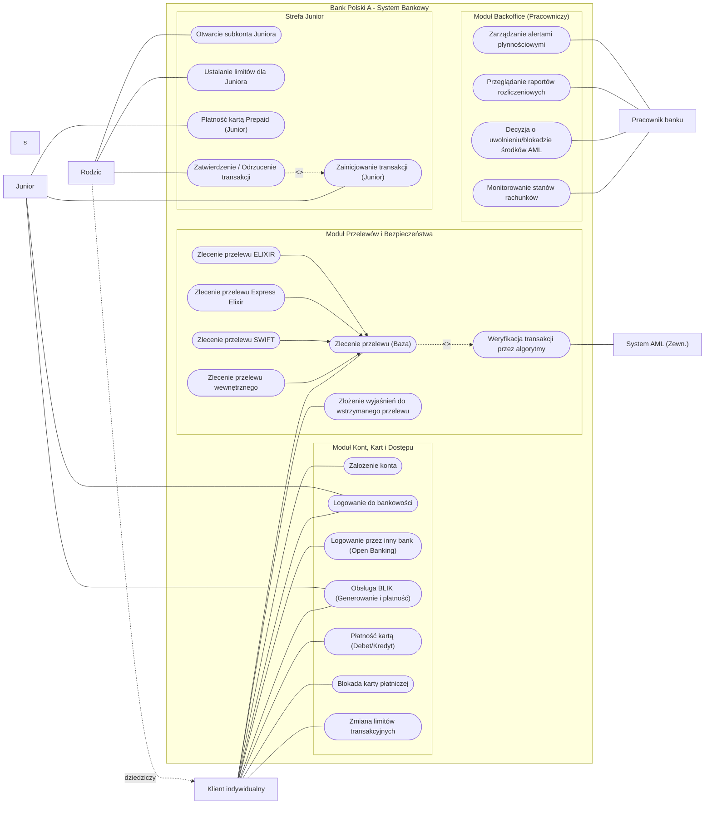
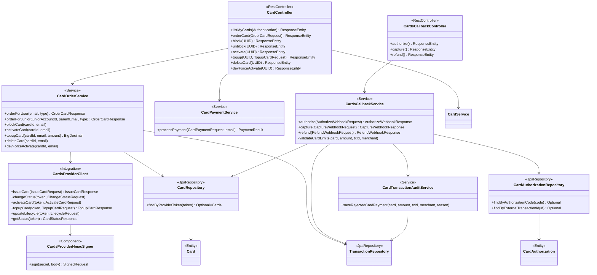
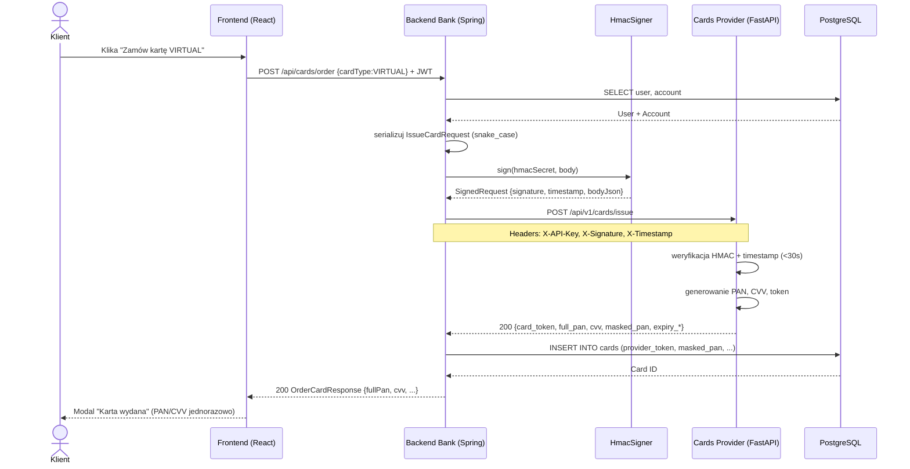
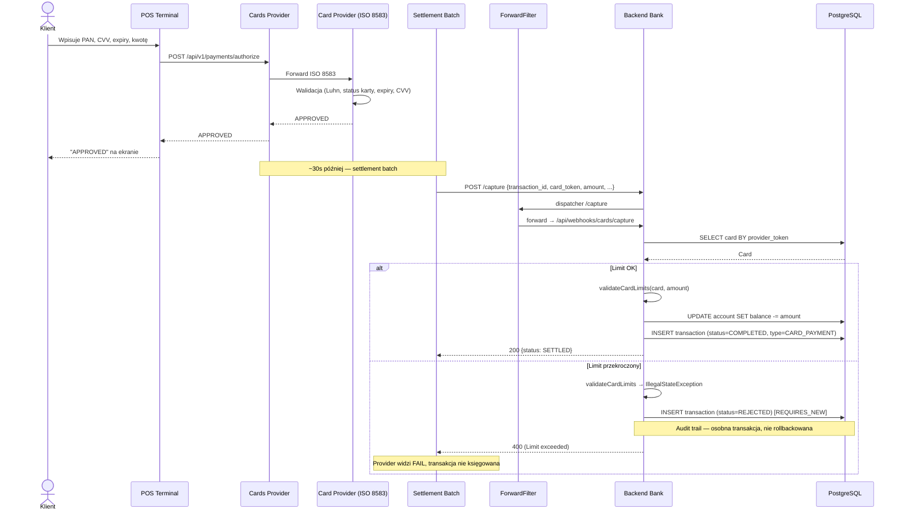
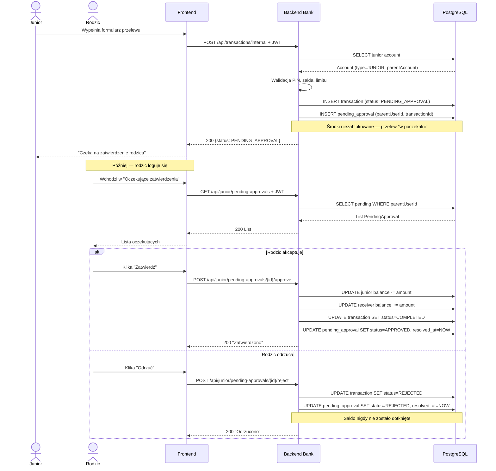
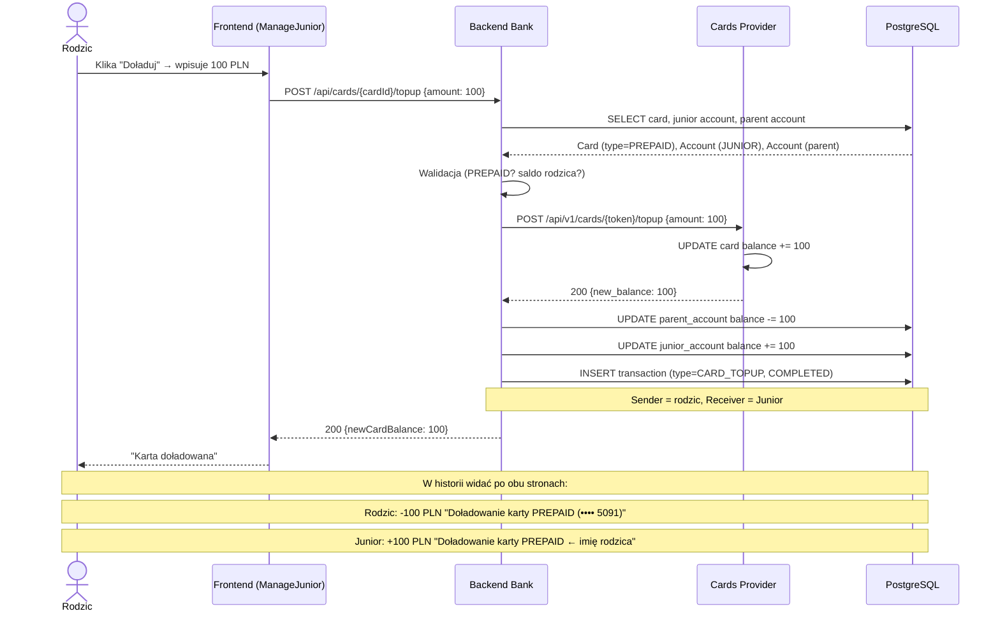

# Polski Bank A

Projekt grupowy z przedmiotu Aplikacje biznesowe moduł **Bank Polski / Bank A**, mający na celu stworzenie aplikacji webowej symulującej działanie polskiego banku. Głównym motywem jest integracja różnych modeli płatności.

## Spis treści

1. [Opis projektu](#opis-projektu)
2. [Zakres projektu](#zakres-projektu)
3. [Stos technologiczny](#stos-technologiczny)
4. [Wiedza domenowa](#wiedza-domenowa)
5. [Diagramy](#diagramy)
6. [Architektura](#architektura)
7. [Struktura projektu](#struktura-projektu)
8. [Uruchomienie](#uruchomienie)
9. [Zespół](#zespół)

## 1. Opis projektu
Polski Bank A to aplikacja bankowa umożliwiająca obsługę różnych typów przelewów: wewnętrznych, międzybankowych (ELIXIR/SEPA), natychmiastowych, SORBNET oraz międzybankowych SWIFT. APlikacja integruje się z zewnętrznymi systemami rozliczeniowymi i dostawcami kart płatniczych.

## 2. Zakres projektu

Zakres funkcjonalności projektu objemuje:
- **Przelewy wewnętrzene** - przelewy między kontami realizowane w obrębie tego banku
- **ELIXIR** - standardowe rozliczenie międzybankowe realizowane w sesjach dziennych
- **Express ElIXIR** - natychmiastowy przelew międzybankowy, umożliwiający transfer środków w kilka sekund w tybie 24/7/365
- **SORBNET3** - rozliczenie międzybankowe typu RTGS, służący do przetwarzania wysokokwotowych przelewów w czasie rzeczywistym
- **SWIFT** - globalny system do realizacji bezpiecznych przelewów zagranicznych
- **BLIK** - bezpieczne i błyskawiczne transakcje bez użycia karty lub gotówki, używając generowanego sześciocyfrowego kodu w aplikacji bankowej
- **Karty płatnicze** - integracja z płatnoścami za pośrednictwem kart, transakcje w PLN
- **Konto Junior (7-13lat)** - konto podpięte pod konto rodzica a wszystkie transakcje wymagają jego zatwierdzenia

## 3. Stos technologiczny
| Warstwa        | Technologia              |
|----------------|--------------------------|
| Backend        | Java 21 + Spring Boot    |
| Frontend       | React (TypeScript)+ Vite |
| Baza danych    | PostgreSQL               |
| Auth           | Spring Security          |
| Konteneryzacja | Docker + Docker Compose  |
| API docs       | Swagger                  |

## 4. Wiedza domenowa
Niniejsza sekcja dokumentacji gromadzi kluczową wiedzę biznesową i techniczną niezbędną do zaprojektowania oraz wdrożenia modułów transakcyjnych aplikacji bankowej. 

### 4.1 ELIXIR
Elixir jest to podstawowy ssystem elektronicznych rozliczeń międzybankowych w Polsce (zarządzany przez KIR). Odpowiada za masową obsługę standardowych przelewów krajowych w PLN. Działa w oparciu o sesje (zazwyczaj 3 razy dziennie w dni robocze), co oznacza że środki trafiają do odbiorcy w ciągu kilku godzin.

#### 4.1.1 Architektura

Opiera się na wymianie zaszyfrowanych paczek danych pomiędzy bankami a KIR najczęściej poprzerz protokół SFTP. Dane są szyfrowane a pliki podpisywane elektronicznie

System bankowy (BANK A) -> SFTP -> KIR -> SFTP -> System bankowy (BANK B)

#### 4.1.2 Sytuacje brzegowe
 1. Niewypłacalność lub brak płynności banku w trakcie sesji
  - **Sytuacja:** Bank nadawcy wysłał paczkę z przelewami ale w momencie rozrachunku sesji okazuje się, że nie ma wystarczających środków na swoim rachunku rezerwy obowiązkowej w NBP.
  - **Obsługa:** Uruchamiany jest mechanizm gwarancyjny. Kir posiada fundusz gwarancyjny z którego pokrywa ewentualne niedobory aby sesja mogła się odbyć dla reszty rynku. Natomiast jeżeli braki są drastyczne KIR może użyć tzw. unwinding - odkręcenie transakcji czyli wykluczenie z sesji przelewów od tego konkretnego banku.
    
2. Przelew na konto, które nie istnieje (lub jest zamknięte)
  - **Sytuacja:** Użytkownik wpisuje poprawny matematycznie numer NRB (suma kontrolna modulo 97 się zgadza, kod banku jest poprawny), ale rachunek w banku docelowym został zamknięty, zajęty i zablokowany lub nigdy nie istniał
  - **Obsługa:** Aplikacja wypuści przelew lecz bank odbiorcy ma obowiązek (najczęściej w kolejnej najbliższej sesji Elixir) odesłać te środki z powrotem za pomocą komunikatu zwrotu (return). System musi asynchronicznie nasłuchiwać komunikaty zwrotne z KIR. gdy taki nadejdzie, aplikacja musi atomatycznie rozpoznać oryginalną transakcję, zaksięgować środki zpowrotem na saldo kliena i wygenerować stosowne powiadomienie.
    
3. Twardy limit kwotowy
  - **Sytuacja** Użytkownik próbuje wysłać przelew na kwotę równą lub wyższą niż milion złotych.
  - **Obsługa** Regulamin Kir dla systemu Elixir odrzuca takie transakcje ponieważ limit to dokładnie 999 999,99 PLN. W takim wypadku walidacja musi nastąpić jeszcze zanim żądanie w ogóle trafi do kolejki wychodzącej.

### 4.2 ELIXIR
*TBD*

### 4.3 Express ELIXIR
*TBD*

### 4.4 SORBNET3
*TBD*

### 4.5 SWIFT
*TBD*

### 4.6 BLIK
*TBD*

### 4.7 Karty płatnicze
*TBD*

## 5. Diagramy

### 5.1 Diagram Przypadków Użycia (Use Case)



Diagram przypadków użycia modeluje interakcje pomiędzy aktorami, a funkcjonalnościami systemu bankowego.

####  Aktorzy i ich uprawnienia:
* **Klient indywidualny:** Główny aktor w systemie. Posiada pełny dostęp do standardowej bankowości: logowanie (w tym Open Banking), realizacja przelewów, obsługa BLIK, zarządzanie kartami płatniczymi oraz limitami transakcyjnymi.

* **Rodzic:** Aktor specyficzny, który dziedziczy wszystkie uprawnienia Klienta indywidualnego, a dodatkowo posiada rozszerzone przywileje: możliwość otwarcia subkonta Juniora, zarządzanie jego limitami oraz autoryzację (zatwierdzanie/odrzucanie) transakcji inicjowanych przez dziecko.

* **Junior (7-13 lat):** Aktor o mocno ograniczonym dostępie. Posiada własne dane do logowania, może realizować płatności kartą Prepaid oraz inicjować przelewy i transakcje BLIK. Nie może jednak samodzielnie sfinalizować przelewu – jego akcje trafiają do "poczekalni".

* **Pracownik banku:** Aktor wewnętrzny. Odpowiada za monitorowanie płynności finansowej, analizę raportów rozliczeniowych oraz ręczne podejmowanie decyzji o zwolnieniu środków zablokowanych przez filtry bezpieczeństwa.

* **System AML (Zewnętrzny):** Zautomatyzowany aktor algorytmiczny, który weryfikuje każdą wychodzącą transakcję pod kątem ryzyka prania brudnych pieniędzy (Anti-Money Laundering) i ewentualnych sankcji (np. przelewy SWIFT wysokiego ryzyka).


### 5.2 Diagram Związków Encji (ERD)


Schemat bazy danych (zaprojektowany dla PostgreSQL) stanowi fundament aplikacji. Architektura została w pełni znormalizowana i zoptymalizowana pod kątem bezpieczeństwa transakcyjnego oraz audytowalności operacji finansowych.

Zamiast standardowych identyfikatorów numerycznych, we wszystkich tabelach zastosowano klucze główne typu **UUID**. Jest to kluczowy mechanizm obronny zapobiegający atakom typu IDOR i uniemożliwiający wyliczanie (enumerację) wielkości bazy klientów przez osoby nieuprawnione.

Baza danych została podzielona na **6 logicznych podsystemów**:

#### 1. Rdzeń Systemu

* **USERS:** Przechowuje kluczowe dane autoryzacyjne oraz profilowe. Ograniczenia UNIQUE nałożone na `customer_number` (8-cyfrowy CIF) oraz `email` gwarantują spójność tożsamości klienta. Pole `date_of_birth` pozwala algorytmom na dynamiczną weryfikację wieku (niezbędne przy kontach Junior). Tabela posiada również pola obsługi kodu PIN: `pin_hash` (BCrypt), `pin_failed_attempts` (licznik nieudanych prób) i `pin_locked_until` (czasowa blokada po przekroczeniu limitu prób — ochrona przed brute-force).

* **ACCOUNTS:** Centralna tabela finansowa wykorzystująca typ `DECIMAL(15, 2)` dla absolutnej precyzji arytmetycznej. Wyróżnia się zastosowaniem **relacji rekurencyjnej** — klucz obcy `parent_account_id` pozwala na zagnieżdżanie subkont (np. kont dzieci) pod kontami głównymi rodziców. Tabela posiada również kolumnę `blocked_funds`, która odseparowuje środki dostępne od tych zamrożonych (np. przez nierozliczone autoryzacje kartowe lub blokady AML).

* **CARDS:** Powiązana z kontem relacją `ON DELETE CASCADE`. Definiuje wirtualne, fizyczne i prepaid nośniki płatnicze. Po integracji z zewnętrznym providerem kart tabela przechowuje **dane referencyjne** (`provider_token`, `provider_status`, `masked_pan`, `bin_prefix`), a **nigdy** pełnego numeru PAN ani CVV. Pełne dane karty są wyświetlane klientowi tylko jednorazowo, w momencie wydania (zgodnie z duchem PCI-DSS). Atrybuty `transaction_limit` i `daily_limit` umożliwiają egzekwowanie limitów po stronie banku przy każdym rozliczeniu.

#### 2. Silnik Rozliczeniowy

* **TRANSACTIONS:** Tabela zaprojektowana jako niezmienna **księga główna** (event log). Zastosowano tu kluczową zasadę audytu: klucze obce `sender_account_id` oraz `receiver_account_id` posiadają regułę `ON DELETE SET NULL`. Dzięki temu, nawet jeśli klient zamknie konto (a jego rekord zniknie z bazy), pełna historia jego przelewów pozostanie nienaruszona do celów kontroli skarbowej. Kolumna `external_payment_id` pozwala na integrację z systemami zewnętrznymi (NBP, SWIFT, provider kart). Rozszerzony enum `type` obsługuje wiele scenariuszy: standardowe przelewy (`INTERNAL`), płatności kartą (`CARD_PAYMENT`), audyt odrzuconych transakcji (`CARD_PAYMENT_REJECTED`), doładowania prepaid (`CARD_TOPUP`), płatności BLIK (`KLIK`).

#### 3. Moduł Nadzoru Autoryzacji (Junior)

* **PENDING_APPROVALS:** Dedykowana "poczekalnia" dla zleceń oczekujących. Wiąże ze sobą konto Juniora, identyfikator Rodzica oraz konkretną transakcję. Tabela obsługuje **maszynę stanów** z flagami `PENDING`, `APPROVED`, `REJECTED`, przechowując precyzyjne stemple czasowe (`resolved_at`) każdej decyzji podjętej przez opiekuna. Środki Juniora pozostają nienaruszone do momentu zatwierdzenia — to gwarantuje że bez zgody rodzica żadne pieniądze nie opuszczają konta dziecka.

#### 4. Ekosystem BLIK (KLIK)

* **KLIK_CODES:** Zarządza rygorystycznym cyklem życia kodów jednorazowych (6 cyfr). Poza statusami (`ACTIVE`, `USED`, `EXPIRED`) oraz stemplami czasowymi, posiada kluczową dla systemów rozproszonych kolumnę `idempotency_key`. Zabezpiecza ona przed podwójnym obciążeniem konta klienta w przypadku opóźnień sieciowych (tzw. retry attacks).

* **KLIK_ALIASES:** Rozwiązuje problem mapowania numeru telefonu klienta na jego `account_id`, umożliwiając realizację błyskawicznych przelewów P2P (Peer-to-Peer) w systemie Express Elixir.

* **KLIK_AUTHORIZATIONS:** Dedykowana tabela do obsługi **webhooków od dostawcy KLIK**. Przechowuje stan każdej żądanej autoryzacji płatności w cyklu `PENDING → CONFIRMED/REJECTED/EXPIRED`. Klient w aplikacji widzi listę oczekujących autoryzacji i jednym kliknięciem zatwierdza lub odrzuca każdą z nich. Pole `external_id` pozwala na **idempotentne** odbieranie wielokrotnych webhooków od dostawcy KLIK.

#### 5. System Anti-Money Laundering

* **AML_HOLDS:** Tabela prewencyjna dla transakcji i kont wysokiego ryzyka. Wiąże się bezpośrednio z podejrzaną transakcją lub całym kontem klienta. Umożliwia asynchroniczną komunikację na linii Bank-Klient poprzez kolumny `reason` (powód blokady nałożonej przez algorytm) oraz `client_explanation` (wyjaśnienia dostarczone z poziomu aplikacji klienckiej). Po przeglądnięciu wyjaśnień pracownik banku może zwolnić blokadę (`status: RELEASED`).

#### 6. Integracja z Providerem Kart Płatniczych

* **CARD_AUTHORIZATIONS:** Tabela kluczowa dla **asynchronicznej integracji** z zewnętrznym systemem kart płatniczych. Obsługuje pełen cykl rozliczenia transakcji kartowej: od pre-autoryzacji (`HELD`), przez settlement (`SETTLED`), aż po ewentualne zwroty (`REFUNDED`) lub wygasanie (`EXPIRED`). Kolumna `external_transaction_id` z ograniczeniem `UNIQUE` zapewnia **idempotencję webhooków** — wielokrotne wywołanie `/capture` z tym samym `transaction_id` przez providera (np. po niepowodzeniu sieciowym) zwraca tę samą decyzję bez podwójnego obciążenia konta. Pole `authorization_code` zapewnia unikalny identyfikator nadany przez bank, używany przez providera w późniejszych operacjach (settlement, refund).

---

**Migracje Flyway** zarządzają ewolucją schematu w sposób kontrolowany:
- `V1__init_schema.sql` — podstawowy schemat (USERS, ACCOUNTS, CARDS, TRANSACTIONS, PENDING_APPROVALS, KLIK_CODES, KLIK_ALIASES, AML_HOLDS)
- `V2__add_pin.sql` — kolumny obsługi kodu PIN w tabeli USERS
- `V3__junior_card_limits.sql` — dodanie `daily_limit` w CARDS oraz wsparcia limitów dziennych
- `V4__klik_authorizations.sql` — tabela KLIK_AUTHORIZATIONS (asynchroniczne webhooki BLIK)
- `V5__cards_provider_integration.sql` — kolumny providera w CARDS (`provider_token`, `provider_status`, `masked_pan`, `bin_prefix`) + tabela CARD_AUTHORIZATIONS


### 5.3 Diagram Klas (UML)

Sekcja prezentuje dwa diagramy klas o **różnym poziomie abstrakcji**, które razem opisują warstwę domenową aplikacji:

- **5.3.1 Model domeny** — odpowiednik diagramu klas dla analityka. Pokazuje **co** istnieje w systemie: encje biznesowe (klient, konto, karta, transakcja), ich atrybuty oraz wzajemne relacje. Stanowi mostek między ERD (sekcja 5.2), a kodem aplikacji.
- **5.3.2 Architektura warstwowa** — diagram dla programisty. Pokazuje **jak** komponenty współpracują w kodzie: które klasy są kontrolerami REST, które serwisami z logiką biznesową, które adapterami do systemów zewnętrznych. Zaprezentowana na przykładzie modułu kart (najbardziej rozbudowanego), ten sam schemat warstw stosowany jest w pozostałych modułach.

#### 5.3.1 Model domeny — encje główne


Każdy obiekt domeny ma identyfikator typu UUID (zgodnie z konwencją z ERD), enkapsulując dane biznesowe związane z określoną odpowiedzialnością. Relacje 1-do-wielu (np. `User ←→ Account`) odzwierciedlają realny model bankowy: klient może mieć wiele kont, konto wiele kart, karta wiele autoryzacji. Relacja rekurencyjna `Account → Account (parentAccount)` modeluje hierarchię rodzic-Junior. Klasa `UserRole` jest enumeracją wyodrębnioną dla jasności typów.

#### 5.3.2 Architektura warstwowa (na przykładzie modułu kart)

Aplikacja stosuje klasyczny podział na warstwy: Controller → Service → Repository → Entity. Poniższy diagram pokazuje strukturę dla modułu kart, włącznie z integracją zewnętrzną.



Każde żądanie HTTP klienta przechodzi przez warstwy: **Controller** (walidacja, mapowanie DTO), **Service** (logika biznesowa, transakcje), **Repository** (dostęp do bazy), **Entity** (model danych). Integracja z zewnętrznym systemem kart jest enkapsulowana w warstwie `Integration` (`CardsProviderClient`), co realizuje wzorzec **Adapter**: zewnętrzny system jest abstrakcją, którą resztę aplikacji widzi jako lokalny serwis.

### 5.4 Diagramy Sekwencji

W odróżnieniu od diagramów klas (które pokazują **strukturę statyczną**), diagramy sekwencji pokazują **dynamiczne interakcje** w czasie. Każdy z poniższych przepływów obrazuje pełną podróż żądania od użytkownika do bazy danych — łącznie z systemami zewnętrznymi (provider kart). Wybrano cztery procesy najbardziej charakterystyczne dla aplikacji bankowej: dwa wymagające integracji zewnętrznej (5.4.1, 5.4.2) i dwa wewnętrzne ale z wieloma stanami (5.4.3, 5.4.4).

#### 5.4.1 Zamówienie karty u providera (HMAC-signed)

Pokazuje pełen flow zamówienia karty przez klienta, włącznie z podpisem HMAC i zapisem `provider_token` do lokalnej bazy banku.


Diagram pokazuje wydanie karty z perspektywy całego systemu. Kluczowa jest **walidacja autentyczności żądania** po stronie providera kart, oparta na podpisie HMAC-SHA256. Bank generuje podpis ze swojego sekretu HMAC, providera weryfikuje go używając tego samego klucza pobranego z bazy. Trzy nagłówki (`X-API-Key`, `X-Signature`, `X-Timestamp`) zapewniają: identyfikację banku, integralność body i ochronę przed atakami replay (timestamp musi być nie starszy niż 30 sekund). Po pomyślnym zwróceniu danych karty bank **trwale zapisuje** `provider_token` i `masked_pan`, ale pełen PAN i CVV przekazuje klientowi tylko **jednorazowo** w odpowiedzi — nigdy nie są zapisywane lokalnie (zgodnie z duchem PCI-DSS).

#### 5.4.2 Płatność kartą — od POS do settlement w banku

Najważniejszy flow biznesowy. Pokazuje rozróżnienie między autoryzacją (online u providera) a settlement (asynchroniczny webhook do banku z walidacją limitów).


Najważniejszy diagram dla zrozumienia rozdziału **autoryzacji** od **rozliczenia**. Provider kart sprawdza autoryzację natychmiast, lokalnie, w komunikacie ISO 8583 (status karty, CVV, expiry) — POS dostaje APPROVED w sekundach. Bank dowiaduje się o transakcji dopiero po stronie settlementu, ok. 30s później, gdy batch wywołuje webhook `/capture`. W tym momencie bank dokonuje **dodatkowej walidacji**: limitów ustalonych przez klienta (transakcji + dziennego) i statusu blokady. Jeśli walidacja się uda — saldo jest obciążone, transakcja zapisana jako `COMPLETED`. Jeśli przekroczono limit — bank zwraca 400, transakcja **nie jest księgowana**, ale w historii klienta zapisywany jest **wpis audytowy** ze statusem `REJECTED` (w osobnej transakcji bazodanowej dzięki `REQUIRES_NEW`, niezależnie od rollbacku głównej operacji). Klient widzi w aplikacji informację że bank odrzucił płatność z konkretnym powodem.

#### 5.4.3 Przelew z konta Junior — wymagana akceptacja rodzica

Pokazuje mechanizm dwustopniowej autoryzacji: dziecko inicjuje przelew, rodzic akceptuje (lub odrzuca).


Mechanizm **dwustopniowej autoryzacji** dla nieletnich klientów. Junior może w aplikacji wypełnić formularz przelewu wewnętrznego, ale system **nie wykonuje go od razu** — zamiast tego umieszcza transakcję w "poczekalni" (`PENDING_APPROVAL`) i tworzy odpowiadający rekord `PendingApproval` widoczny dla rodzica. Środki **nie są blokowane** na koncie Juniora — saldo zostaje nienaruszone do momentu decyzji rodzica. Rodzic w swojej aplikacji widzi listę oczekujących transakcji dzieci i może je zatwierdzić lub odrzucić jednym kliknięciem. Dopiero w momencie zatwierdzenia odbywa się rzeczywisty transfer środków. To realizacja wymagania z PDF: *"wszystkie transakcje z konta Junior muszą być zatwierdzone przez rodzica"*.

#### 5.4.4 Doładowanie karty PREPAID Juniora

Najbardziej złożony flow w module Junior — łączy provider, własne księgowanie i utworzenie transakcji w historii.


Doładowanie karty prepaid pokazuje **koordynację dwóch systemów** (bank + provider) podczas jednej operacji biznesowej. Środki muszą być spójnie zaktualizowane po obu stronach: provider podnosi balance karty (żeby POS akceptował przyszłe płatności do tej kwoty), a bank wykonuje wewnętrzny przelew między kontami rodzica i Juniora (żeby przy kolejnym webhook settlementu konto Juniora miało skąd zostać obciążone). Operacja generuje **jedną** transakcję bankową typu `CARD_TOPUP` widoczną z perspektywy obu kont — rodzic widzi jej w historii jako wypływ (`-100 PLN`), Junior jako wpływ (`+100 PLN`). Maskowany numer karty w tytule pomaga klientowi szybko zidentyfikować której karty dotyczy doładowanie.

## 6. Architektura
> **TODO:** wrzucenie pełnej architektury

## 7. Struktura projektu
> **TODO:** wrzucenie struktury projektu

## 8. Uruchomienie
Projekt został w pełni skonteneryzowany, co gwarantuje spójność środowiska uruchomieniowego. Do uruchomienia całej infrastruktury (Baza danych, Backend, Frontend) wymagany jest jedynie Docker oraz Docker Compose.

### Wymagania wstępne
* Zainstalowany [Docker Desktop](https://www.docker.com/products/docker-desktop/) (lub sam Docker Engine + Compose w systemach Linux)
* Zainstalowany system kontroli wersji `git`

### Krok po kroku

1. **Pobranie repozytorium**
   Otwórz terminal i sklonuj projekt na swój dysk:
   ```bash
   git clone <https://github.com/DominikDz3/polish-bank-a>
   cd polish-bank-a

2. **Uruchomienie kontenerów**
    W głównym folderze projektu (tam, gdzie znajduje się plik docker-compose.yml) wykonaj polecenie:

    ```
    docker compose up --build
    ```
    (Flaga --build wymusza świeżą kompilację kodu Javy i Reacta przed startem aplikacji).

3. **Dostęp do aplikacji**
    Po pojawieniu się w logach informacji o poprawnym uruchomieniu, usługi będą dostępne pod adresami:

    * Frontend (Aplikacja Webowa): http://localhost:5137
    * Backend (API Spring Boot): http://localhost:8080
    * Baza danych (PostgreSQL): localhost:5432

4. **Zatrzymanie aplikacji**
    Jeśli chcesz zatrzymać aplikację, użyj skrótu Ctrl + C w terminalu lub wpisz:

    ```
    docker compose down
    ```

    Jeśli potrzebujesz całkowicie zresetować bazę danych (np. przywrócić pierwotne dane testowe z Seedera), użyj komendy czyszczącej wolumeny:
    ```
    docker compose down -v
    docker compose up --build
    ```


## 9. Zespół
Osoby pracujące w zespole pracują w modelu fullstack (tworzą elementy widoków użytkownika, elementy związane z logiką bazodanową lub API)

Zadania wykonywane do tej pory

| Osoba            | Zadania                                                                                        |
|------------------|------------------------------------------------------------------------------------------------|
| Julia Chmura     | Stworzenie bazy danych, zaprojektowanie diagramów UML, utworzenie encji w backendzie           |
| Dominik Dziadosz | Tworzenie ogólnego zarysu widoków, tworzenie widoku strony głównej, logowania oraz rejestracji |


