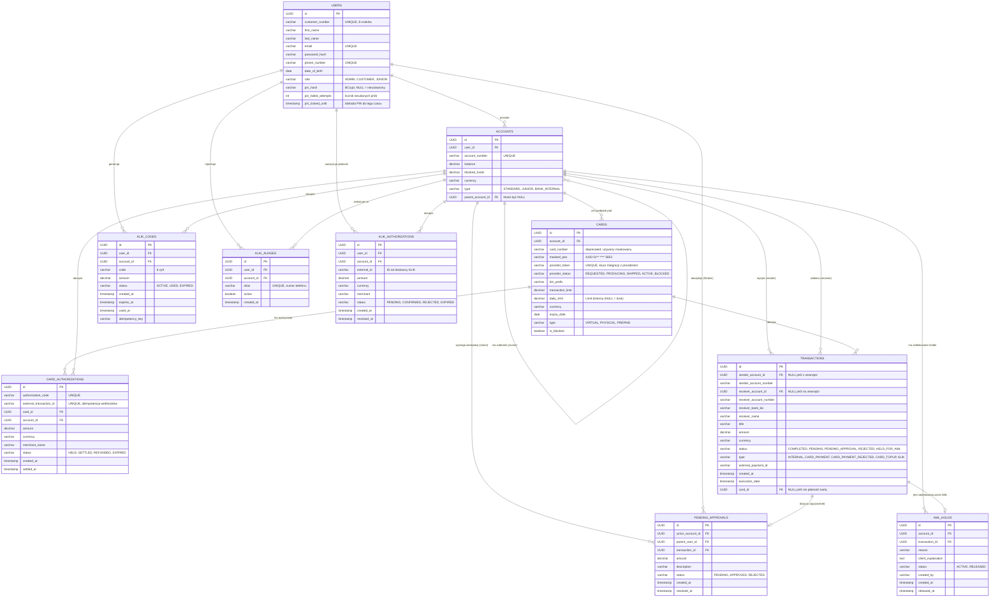
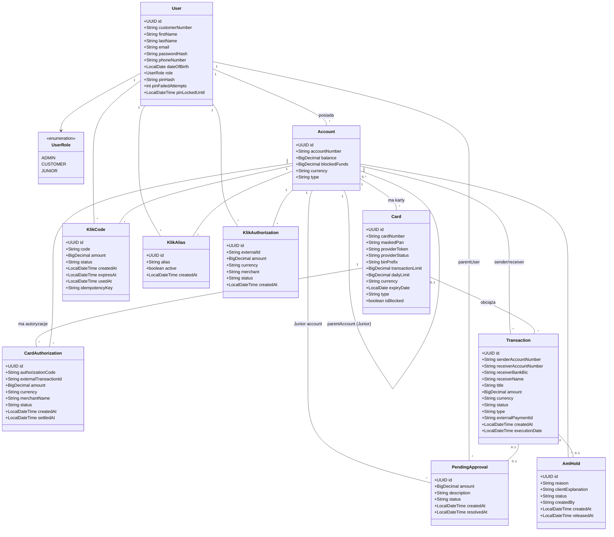
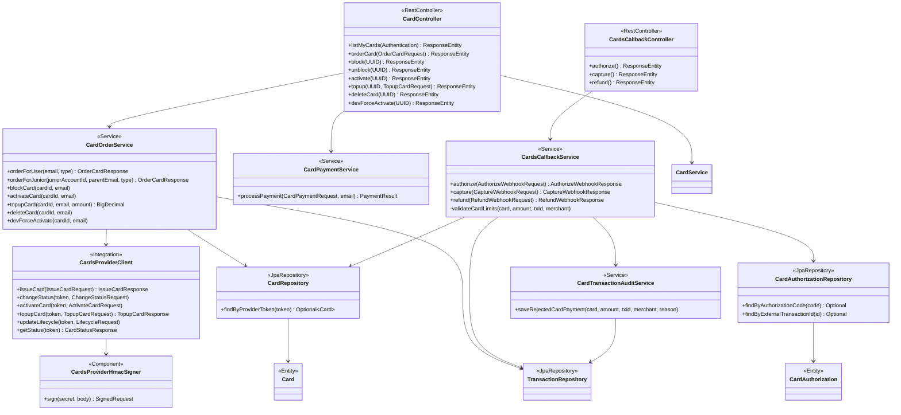
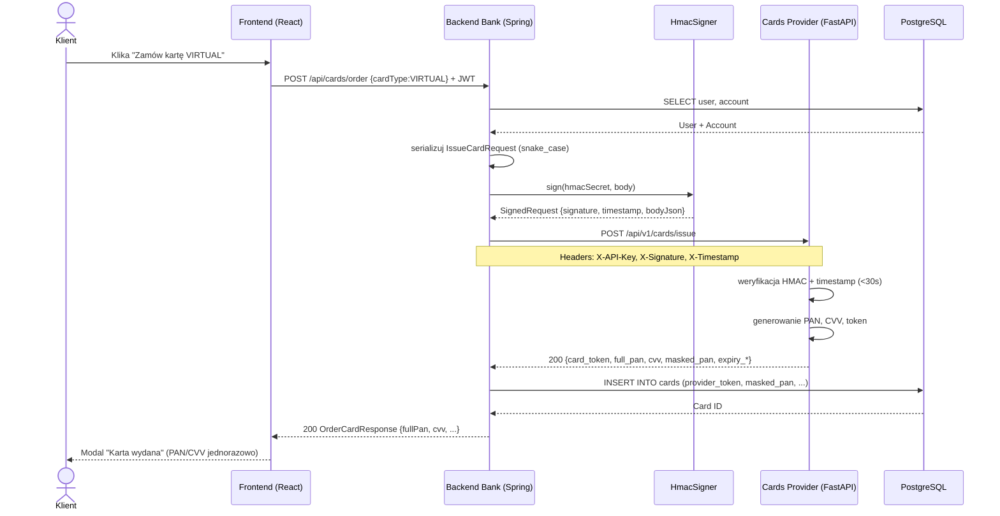
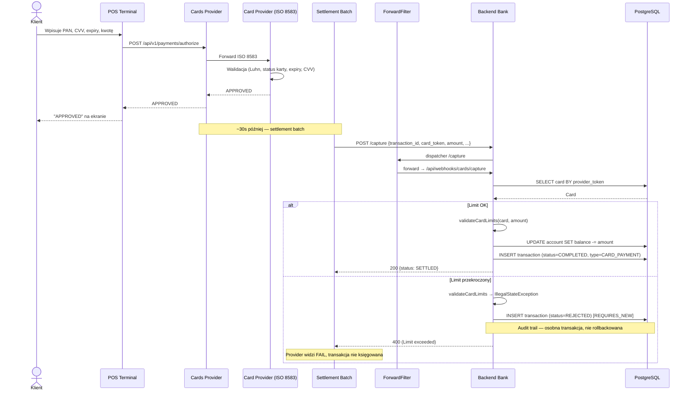
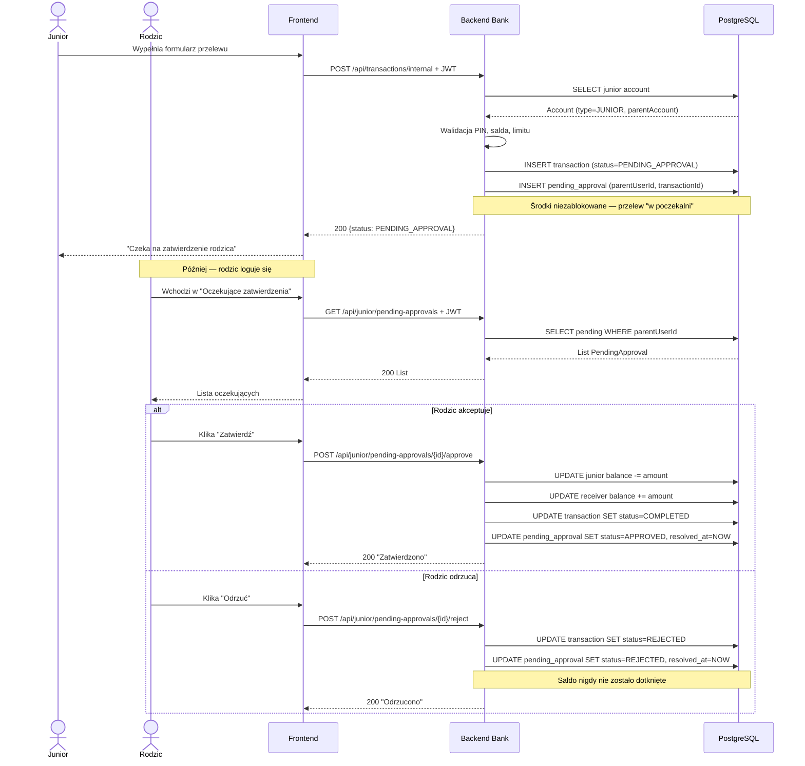
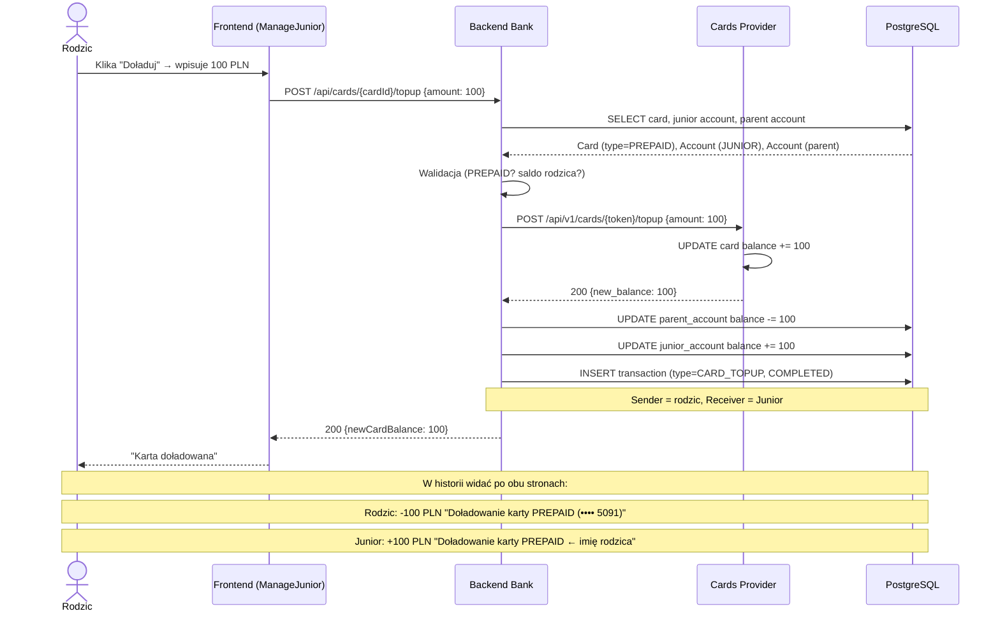

# Polski Bank A

Projekt grupowy z przedmiotu Aplikacje biznesowe moduł **Bank Polski / Bank A**, mający na celu stworzenie aplikacji webowej symulującej działanie polskiego banku. Głównym motywem jest integracja różnych modeli płatności.

## Spis treści

1. [Opis projektu](#opis-projektu)
2. [Zakres projektu](#zakres-projektu)
3. [Stos technologiczny](#stos-technologiczny)
4. [Wiedza domenowa](#wiedza-domenowa)
5. [Diagramy](#diagramy)
6. [Architektura](#architektura)
7. [Struktura projektu](#struktura-projektu)
8. [Uruchomienie](#uruchomienie)
9. [Zespół](#zespół)

## 1. Opis projektu
Polski Bank A to aplikacja bankowa umożliwiająca obsługę różnych typów przelewów: wewnętrznych, międzybankowych (ELIXIR/SEPA), natychmiastowych, SORBNET oraz międzybankowych SWIFT. APlikacja integruje się z zewnętrznymi systemami rozliczeniowymi i dostawcami kart płatniczych.

## 2. Zakres projektu

Zakres funkcjonalności projektu objemuje:
- **Przelewy wewnętrzene** - przelewy między kontami realizowane w obrębie tego banku
- **ELIXIR** - standardowe rozliczenie międzybankowe realizowane w sesjach dziennych
- **Express ElIXIR** - natychmiastowy przelew międzybankowy, umożliwiający transfer środków w kilka sekund w tybie 24/7/365
- **SORBNET3** - rozliczenie międzybankowe typu RTGS, służący do przetwarzania wysokokwotowych przelewów w czasie rzeczywistym
- **SWIFT** - globalny system do realizacji bezpiecznych przelewów zagranicznych
- **BLIK** - bezpieczne i błyskawiczne transakcje bez użycia karty lub gotówki, używając generowanego sześciocyfrowego kodu w aplikacji bankowej
- **Karty płatnicze** - integracja z płatnoścami za pośrednictwem kart, transakcje w PLN
- **Konto Junior (7-13lat)** - konto podpięte pod konto rodzica a wszystkie transakcje wymagają jego zatwierdzenia

## 3. Stos technologiczny
| Warstwa        | Technologia              |
|----------------|--------------------------|
| Backend        | Java 21 + Spring Boot    |
| Frontend       | React (TypeScript)+ Vite |
| Baza danych    | PostgreSQL               |
| Auth           | Spring Security          |
| Konteneryzacja | Docker + Docker Compose  |
| API docs       | Swagger                  |

## 4. Wiedza domenowa
Niniejsza sekcja dokumentacji gromadzi kluczową wiedzę biznesową i techniczną niezbędną do zaprojektowania oraz wdrożenia modułów transakcyjnych aplikacji bankowej. 

### 4.1 ELIXIR
Elixir jest to podstawowy ssystem elektronicznych rozliczeń międzybankowych w Polsce (zarządzany przez KIR). Odpowiada za masową obsługę standardowych przelewów krajowych w PLN. Działa w oparciu o sesje (zazwyczaj 3 razy dziennie w dni robocze), co oznacza że środki trafiają do odbiorcy w ciągu kilku godzin.

#### 4.1.1 Architektura

Opiera się na wymianie zaszyfrowanych paczek danych pomiędzy bankami a KIR najczęściej poprzerz protokół SFTP. Dane są szyfrowane a pliki podpisywane elektronicznie

System bankowy (BANK A) -> SFTP -> KIR -> SFTP -> System bankowy (BANK B)

#### 4.1.2 Sytuacje brzegowe
 1. Niewypłacalność lub brak płynności banku w trakcie sesji
  - **Sytuacja:** Bank nadawcy wysłał paczkę z przelewami ale w momencie rozrachunku sesji okazuje się, że nie ma wystarczających środków na swoim rachunku rezerwy obowiązkowej w NBP.
  - **Obsługa:** Uruchamiany jest mechanizm gwarancyjny. Kir posiada fundusz gwarancyjny z którego pokrywa ewentualne niedobory aby sesja mogła się odbyć dla reszty rynku. Natomiast jeżeli braki są drastyczne KIR może użyć tzw. unwinding - odkręcenie transakcji czyli wykluczenie z sesji przelewów od tego konkretnego banku.
    
2. Przelew na konto, które nie istnieje (lub jest zamknięte)
  - **Sytuacja:** Użytkownik wpisuje poprawny matematycznie numer NRB (suma kontrolna modulo 97 się zgadza, kod banku jest poprawny), ale rachunek w banku docelowym został zamknięty, zajęty i zablokowany lub nigdy nie istniał
  - **Obsługa:** Aplikacja wypuści przelew lecz bank odbiorcy ma obowiązek (najczęściej w kolejnej najbliższej sesji Elixir) odesłać te środki z powrotem za pomocą komunikatu zwrotu (return). System musi asynchronicznie nasłuchiwać komunikaty zwrotne z KIR. gdy taki nadejdzie, aplikacja musi atomatycznie rozpoznać oryginalną transakcję, zaksięgować środki zpowrotem na saldo kliena i wygenerować stosowne powiadomienie.
    
3. Twardy limit kwotowy
  - **Sytuacja** Użytkownik próbuje wysłać przelew na kwotę równą lub wyższą niż milion złotych.
  - **Obsługa** Regulamin Kir dla systemu Elixir odrzuca takie transakcje ponieważ limit to dokładnie 999 999,99 PLN. W takim wypadku walidacja musi nastąpić jeszcze zanim żądanie w ogóle trafi do kolejki wychodzącej.

### 4.2 Express ELIXIR

Express ELIXIR to rozszerzenie systemu KIR dla przelewów natychmiastowych w PLN, działające w trybie **24/7/365** poza standardowym harmonogramem sesyjnym. Każda transakcja rozliczana jest indywidualnie i w czasie rzeczywistym — środki są dostępne na koncie odbiorcy w drugim banku w czasie kilku sekund od zlecenia. Banki uczestniczące utrzymują w KIR osobne konta techniczne wstępnie zasilone płynnością, dzięki czemu nie ma konieczności czekania na sesję rozliczeniową.

#### 4.2.1 Architektura

Komunikacja odbywa się przez REST API z synchroniczną odpowiedzią — bank-nadawca buduje DTO transakcji (JSON), wysyła do operatora Express ELIXIR, a ten natychmiast księguje na kontach technicznych obu banków i potwierdza status.

System bankowy (BANK A) → REST (JSON DTO) → Express ELIXIR (KIR) → REST → System bankowy (BANK B)

Bank nadawcy po pozytywnej odpowiedzi zwalnia blokadę środków i finalizuje księgowanie wychodzące. Brak asynchronicznego pollera — odpowiedź `PROCESSED` przychodzi w tej samej odpowiedzi co request.

#### 4.2.2 Sytuacje brzegowe

1. **Limit kwotowy dla pojedynczego przelewu**
   - **Sytuacja:** Klient próbuje zlecić przelew Express ELIXIR powyżej limitu (zwykle 100 000 PLN).
   - **Obsługa:** Walidacja po stronie banku nadawcy blokuje żądanie przed wysłaniem. Operator KLIK pokazuje sugestię użycia SORBNET3 dla wyższych kwot.

2. **Niewystarczająca płynność banku w Express ELIXIR**
   - **Sytuacja:** Konto techniczne banku-nadawcy w KIR ma zbyt niski stan żeby pokryć przelew.
   - **Obsługa:** Operator Express ELIXIR zwraca `REJECTED` z kodem `INSUFFICIENT_LIQUIDITY`. Bank-nadawca zwraca środki klientowi i alarmuje dział treasury żeby uzupełnić płynność.

3. **Awaria operatora poza godzinami sesji ELIXIR**
   - **Sytuacja:** Klient zleca przelew natychmiastowy w nocy/weekend, operator Express ELIXIR niedostępny.
   - **Obsługa:** Bank zwraca status `REJECTED` z komunikatem "system chwilowo niedostępny, spróbuj za chwilę lub użyj zwykłego ELIXIR-a w najbliższą sesję". Środki nie są blokowane.

### 4.3 SORBNET3

System Obsługi Rachunków Bankowych Narodowego Banku Polskiego — **RTGS** (Real-Time Gross Settlement) prowadzony przez NBP, służący do rozliczeń **wysokokwotowych** w PLN między bankami komercyjnymi, KDPW, KIR i samym NBP. Każda transakcja rozliczana jest **indywidualnie, brutto, w czasie rzeczywistym** na rachunkach technicznych banków prowadzonych w NBP — bez netting'u, bez sesji. System działa w godzinach pracy NBP (07:30–18:00 w dni robocze).

#### 4.3.1 Architektura

Komunikat ISO 20022 `pacs.008` w XML zgodnie z `SttlmMtd=CLRG` i kodem `SORBNET` w nagłówku. Bank-nadawca buduje XML, wysyła do operatora SORBNET3 (NBP), ten księguje natychmiast na kontach technicznych banków i potwierdza synchronicznie statusem `SETTLED`.

System bankowy (BANK A) → REST (pacs.008 XML) → SORBNET3 (NBP) → REST (pain.002 XML) → System bankowy (BANK B)

W realnym SORBNET3 bank-odbiorca otrzymuje forwarded komunikat pacs.008 i wykonuje wewnętrzne uznanie konta klienta końcowego. W uproszczonym mockowanym wariancie symulator obsługuje tylko settlement między kontami technicznymi banków.

#### 4.3.2 Sytuacje brzegowe

1. **Próba przelewu poza godzinami pracy NBP**
   - **Sytuacja:** Klient zleca przelew SORBNET3 w sobotę lub po 18:00.
   - **Obsługa:** Bank-nadawca blokuje żądanie z komunikatem "SORBNET3 działa w godz. 07:30–18:00 w dni robocze". Klient może kolejkować przelew do następnego dnia roboczego lub użyć Express ELIXIR (jeśli kwota mieści się w limicie).

2. **Próba przelewu niskokwotowego**
   - **Sytuacja:** Klient zleca SORBNET3 na kwotę poniżej progu (np. 500 PLN).
   - **Obsługa:** Walidacja banku-nadawcy odrzuca z komunikatem o opłacie nieproporcjonalnej do kwoty (typowa opłata SORBNET3 to ~30 PLN). Sugestia użycia ELIXIR-a lub Express ELIXIR.

3. **Bank-odbiorca nieuczestniczący w SORBNET3**
   - **Sytuacja:** BICFI banku odbiorcy nie ma w tabeli uczestników NBP.
   - **Obsługa:** Operator SORBNET3 zwraca `REJECTED` z kodem `UNKNOWN_PARTICIPANT`. Bank-nadawca odblokowuje środki i informuje klienta że bank odbiorcy nie obsługuje SORBNET-u — alternatywą jest ELIXIR.

### 4.4 SWIFT

**Society for Worldwide Interbank Financial Telecommunication** — globalna sieć wymiany komunikatów finansowych pomiędzy ponad 11 000 instytucjami w ~200 krajach. SWIFT sam w sobie **nie jest systemem rozliczeniowym** ani nie przekazuje pieniędzy — jest standardem komunikacji (formaty MT i nowsze ISO 20022) służącym do bezpiecznego przekazywania zleceń płatniczych między bankami, które rozliczają się następnie na rachunkach korespondencyjnych (nostro/loro) lub przez clearing houses w docelowych walutach. Z perspektywy banku detalicznego SWIFT odpowiada za **przelewy zagraniczne i walutowe**.

#### 4.4.1 Architektura

Bank-nadawca buduje komunikat `pacs.008` w XML, podpisuje OAuth2 tokenem i wysyła do middleware SWIFT. Middleware routuje przelew przez sieć banków pośredniczących (multi-hop) zgodnie z grafem łączności BIC ↔ BIC. Statusy są asynchroniczne — webhook od middleware przychodzi z `IN_TRANSIT`, `SETTLED` lub `RETURN`.

System bankowy (BANK A) → OAuth2 + REST (pacs.008) → Middleware SWIFT → wiele hopów → BIC docelowy

Bank-odbiorca odczytuje `CdtrAcct/IBAN` z komunikatu i wykonuje wewnętrzne uznanie konta klienta końcowego. Rozliczenie finansowe między bankami odbywa się poza warstwą komunikacyjną, na nostro/loro.

#### 4.4.2 Sytuacje brzegowe

1. **Bank lub konto odbiorcy nie istnieje**
   - **Sytuacja:** Komunikat dociera do banku docelowego, ale podany IBAN nie istnieje w jego systemie (zamknięty, błędny, fraud).
   - **Obsługa:** Bank-odbiorca generuje `RETURN` (komunikat zwrotny `pacs.004`), który wraca tą samą drogą do banku-nadawcy. Webhook middleware przekazuje go do naszego systemu, ten odblokowuje środki klientowi i ustawia status `RETURNED` z przyczyną.

2. **Brak ścieżki routingu między BIC**
   - **Sytuacja:** Middleware nie zna trasy z `PLBKPL01XXX` do BIC odbiorcy (np. mały bank z egzotycznego kraju).
   - **Obsługa:** Middleware zwraca synchronicznie 404 `Route not found`. Bank-nadawca odblokowuje środki i informuje klienta że ten bank nie jest osiągalny w sieci SWIFT.

3. **Niezgodność waluty z preferencjami banku pośredniczącego**
   - **Sytuacja:** Przelew w egzotycznej walucie wymaga konwersji przez bank pośredniczący, który nie wspiera tej pary walutowej.
   - **Obsługa:** Bank pośredniczący zwraca komunikat zwrotny z kodem `CURRENCY_UNSUPPORTED`. Środki wracają do banku-nadawcy, status `RETURNED`. Klient otrzymuje powiadomienie żeby skorzystać z innej waluty rozliczeniowej.

4. **Naliczenie opłat (OUR/SHA/BEN)**
   - **Sytuacja:** Klient zaznaczył `OUR` (płaci nadawca), middleware zwraca dodatkowy webhook `X-SWIFT-Fee-For` z kwotą opłaty od banku pośredniczącego.
   - **Obsługa:** System odnotowuje opłatę w `SwiftTransfer.feeIntermediary`, doliczając ją do obciążenia konta klienta. Klient widzi w historii rozbicie opłat (sender / receiver / intermediary).

### 4.5 BLIK / KLIK

Polski system płatności mobilnych prowadzony przez Polski Standard Płatności (PSP) — w naszej implementacji występuje pod nazwą **KLIK**. System nie jest klasycznym rozliczeniem międzybankowym, lecz **warstwą tożsamości i autoryzacji** nad istniejącymi torami płatniczymi (kartowymi, Express ELIXIR, wewnętrznymi przelewami banku). Obsługuje dwie główne ścieżki:

- **Kod KLIK przy płatności u sprzedawcy (C2B)** — klient generuje w aplikacji 6-cyfrowy kod ważny ~2 minuty, sprzedawca przekazuje go acquirerowi, ten woła KLIK, KLIK woła bank klienta, klient potwierdza PIN-em w aplikacji, bank obciąża rachunek.
- **Przelew na telefon (P2P)** — klient rejestruje swój numer telefonu jako alias w KLIK z powiązaniem do IBAN. Inny klient (z dowolnego banku) wysyła na ten numer, jego bank wykonuje lookup w KLIK, otrzymuje IBAN odbiorcy i wykonuje przelew **poza KLIK** — torem Express ELIXIR (off-us) lub wewnętrznie (on-us).

#### 4.5.1 Architektura

KLIK to centralna platforma autoryzacji + księga aliasów. Wszystkie banki uczestniczące mają osobne klucze API i statystyki aktywacji modułów (`c2b_enabled`, `p2p_enabled`).

**C2B (kod):**

System bankowy (BANK A) → REST (generate code) → KLIK → kod 6-cyfrowy → klient → POS → Acquirer → REST → KLIK → webhook authorize → System bankowy (BANK A) → potwierdzenie PIN-em → REST (confirm) → KLIK

**P2P (na telefon):**

System bankowy (BANK A) → REST (lookup phone) → KLIK → {bank_code, IBAN} → BANK A wykonuje przelew Express ELIXIR (off-us) lub wewnętrzny (on-us) → poza KLIK

KLIK nigdy nie uczestniczy w fizycznym transferze środków P2P — zwraca wyłącznie routing.

#### 4.5.2 Sytuacje brzegowe

1. **Wygaśnięcie kodu KLIK przed potwierdzeniem**
   - **Sytuacja:** Klient wygenerował kod, ale nie podał go u sprzedawcy w ciągu 2 minut.
   - **Obsługa:** Bank odbiera webhook autoryzacyjny po wygaśnięciu — odrzuca z kodem `EXPIRED`. KLIK marketuje kod jako nieaktywny, sprzedawca informowany. Klient generuje nowy kod.

2. **Brak rejestracji numeru w KLIK przy P2P**
   - **Sytuacja:** Klient próbuje wysłać przelew na telefon na numer, który nie ma aktywnego aliasu.
   - **Obsługa:** Lookup zwraca `404_ALIAS_NOT_FOUND`. Bank-nadawca wyświetla klientowi komunikat "ten numer nie jest zarejestrowany w KLIK — możesz wysłać klasyczny przelew na IBAN".

3. **Próba rejestracji numeru już zarejestrowanego w innym banku**
   - **Sytuacja:** Klient banku A chce zarejestrować numer, który ma już alias w banku B (np. po zmianie banku).
   - **Obsługa:** KLIK zwraca `409_ALIAS_ALREADY_EXISTS`. Klient musi najpierw w banku B wyrejestrować numer (DELETE alias), dopiero potem może go zarejestrować u nas.

4. **Konflikt strefy (cross-zone)**
   - **Sytuacja:** Numer telefonu nie pasuje do strefy banku rejestrującego (np. polski bank rejestruje US numer).
   - **Obsługa:** KLIK zwraca `422_ZONE_MISMATCH`. Bank-nadawca odrzuca z komunikatem o niezgodności strefy.

### 4.7 Karty płatnicze

Karta płatnicza to instrument płatniczy wydany przez bank (issuer) i obsługiwany przez zewnętrznego providera kart. Bank A jest **issuerem** — zamawia karty u providera, autoryzuje wydanie ich klientowi, prowadzi konto z którego rozliczane są transakcje. Provider zarządza cyklem życia karty, generowaniem PAN/CVV i autoryzacją płatności w sieci POS.

#### 4.7.1 Architektura integracji

System współpracuje z providerem [Karty-Platnicze-Aplikacje-Biznesowe](https://github.com/FilipSl3/Karty-Platnicze-Aplikacje-Biznesowe) w modelu czterostronnym (Cardholder ↔ Issuer Bank ↔ Acquirer/POS ↔ Merchant).

Komunikacja dwukierunkowa:

* **Bank → Provider** (REST + HMAC-SHA256): zamawianie karty, blokada/odblokowanie, aktywacja, doładowanie PREPAID, lifecycle (DEV). Każde żądanie podpisane HMAC-SHA256 z timestampem (ochrona przed replay attacks, ważne 30s).
* **Provider → Bank** (REST, bez auth, sieć VPN/Docker internal): webhook `/capture` (rozliczenie po settlement). W rzeczywistości bank A jest osiągalny w sieci `cards-backend` pod aliasem `polish-bank-a:8000`.

#### 4.7.2 Typy kart

| Typ | Domyślny limit transakcji | Domyślny limit dzienny | Aktywacja | Przeznaczenie |
|---|---|---|---|---|
| **VIRTUAL** | 500 PLN | 2 000 PLN | Auto, do 1h | Zakupy online |
| **PHYSICAL** | 5 000 PLN | 20 000 PLN | Po dostawie (REQUESTED → PRODUCING → SHIPPED → ACTIVE) | Karta główna |
| **PREPAID** | 200 PLN | 500 PLN | Auto, do 1h | Konto Junior — wymaga zasilenia przez rodzica |

#### 4.7.3 Lifecycle karty
REQUESTED → PRODUCING → SHIPPED → ACTIVE ↔ BLOCKED
↓
USUNIĘTA (BLOCKED u providera + delete lokalnie)


Dla VIRTUAL provider auto-aktywuje kartę po 1h. Dla PHYSICAL klient (bank) musi przeprowadzić kartę przez cykl produkcji. Endpoint **"Wymuś aktywację (DEV)"** symuluje pełen cykl jednym kliknięciem na potrzeby demonstracji.

#### 4.7.4 Flow płatności kartą

1. Klient w POS providera podaje PAN + CVV + expiry + kwotę.
2. Provider lokalnie autoryzuje (sprawdza status, expiry, balance dla PREPAID).
3. POS pokazuje **APPROVED**.
4. Co 30s settlement batch wywołuje `POST /capture` na webhook banku.
5. Bank waliduje **limity karty** (transakcji, dzienny, blokada).
   * Jeśli OK → `Account.balance -= amount`, zapis `Transaction` ze statusem `COMPLETED`.
   * Jeśli przekroczono limit → `Transaction` ze statusem `REJECTED` (audit trail), saldo niezmienione, provider dostaje HTTP 400.
6. Klient widzi transakcję w historii (zrealizowaną lub odrzuconą z powodem).

#### 4.7.5 Karta Junior (PREPAID)

* Rodzic zamawia kartę PREPAID dla konta dziecka.
* Doładowanie karty = przelew z konta rodzica → konto Juniora + topup u providera. Klient widzi w historii rodzica `-X PLN "Doładowanie karty PREPAID (•••• 5091)"` i Juniora `+X PLN`.
* Rodzic może w panelu Junior: zamówić kartę, aktywować (DEV), doładować, ustawić limity (transakcji + dzienny), zablokować, odblokować, usunąć.
* Junior używa karty u POS, capture obciąża jego konto.

#### 4.7.6 Bezpieczeństwo

* **PCI-DSS friendly**: bank lokalnie przechowuje tylko `provider_token` + `masked_pan` (np. `4100 01** **** 5091`), nigdy pełnego PAN ani CVV.
* **Idempotencja webhooków** przez `card_authorizations.external_transaction_id UNIQUE` — wielokrotne wywołanie capture z tym samym `transaction_id` zwraca tę samą decyzję.
* **HMAC-SHA256** podpis żądań do providera (sekret w env, weryfikacja timestamp).
* **REJECTED audit trail** — każda transakcja odrzucona z powodu limitu jest zapisana w historii w osobnej transakcji DB (`REQUIRES_NEW`), niezależnie od rollbacku głównej transakcji webhooka.

#### 4.7.7 Endpointy banku

| Endpoint | Metoda | Opis |
|---|---|---|
| `/api/cards` | GET | Lista kart klienta |
| `/api/cards/junior/{accountId}` | GET | Karty Juniora (dla rodzica) |
| `/api/cards/order` | POST | Zamów VIRTUAL/PHYSICAL |
| `/api/cards/junior/{accountId}/order` | POST | Zamów PREPAID dla Juniora |
| `/api/cards/{id}/block` `/unblock` `/activate` | POST | Lifecycle |
| `/api/cards/{id}/topup` | POST | Doładowanie PREPAID (rodzic→Junior) |
| `/api/cards/{id}/limits` | PATCH | Limity transakcji/dzienny |
| `/api/cards/{id}` | DELETE | Trwałe usunięcie (BLOCKED u providera + delete lokalnie) |
| `/api/cards/{id}/dev/force-activate` | POST | DEV: REQUESTED → ACTIVE |
| `/capture` (alias dla `/api/webhooks/cards/capture`) | POST | Webhook od providera — settlement |

### 4.8 System AML (Anti-Money Laundering)

System przeciwdziałania praniu pieniędzy emuluje typowy moduł nadzoru transakcyjnego stosowany w polskich bankach detalicznych. Każda transakcja wychodząca przed wysłaniem do systemu rozliczeniowego (ELIXIR / Express ELIXIR / SORBNET3 / SWIFT / KLIK P2P) przechodzi przez **silnik reguł**. Jeśli którakolwiek reguła zostanie aktywowana, transakcja zostaje **wstrzymana w stanie `HELD_FOR_AML`**, środki są zablokowane, a klient otrzymuje powiadomienie wraz z możliwością złożenia wyjaśnień. Bank (rola `ADMIN`) podejmuje finalną decyzję — zatwierdzenie powoduje wznowienie i finalizację przelewu, odrzucenie zwraca środki na konto klienta.

#### 4.8.1 Architektura

Silnik AML jest komponentem wewnętrznym banku (bez zewnętrznego serwisu) — wszystkie reguły, decyzje i stan trzymane w bazie banku.

System bankowy (request klienta) → blokada środków → AmlEvaluator → reguła wstrzymuje → `aml_hold` + status `HELD_FOR_AML` → klient składa wyjaśnienia → admin decyduje → finalize lub cancel

Sześć reguł aplikowanych w trybie "first match wins":

- **HighAmount** — internal/external ≥ 15 000 PLN (próg raportowania GIIF + dyrektywa UE)
- **SwiftHighAmount** — SWIFT EUR ≥ 5 000 / USD ≥ 6 000 / GBP ≥ 4 000
- **HighRiskCountry** — SWIFT z krajem z listy FATF/sankcji UE (RU, BY, KP, IR, SY, AF, MM, VE, CU, SD, SS, YE)
- **SuspiciousTitle** — tytuł zawiera frazę-czerwoną-flagę (`crypto`, `bitcoin`, `darknet`, `cash only`, `kasyno`, `donacja`, itp.)
- **Structuring** — > 5 przelewów do tego samego odbiorcy w ostatniej godzinie (próba obejścia progów)
- **NewBeneficiaryHighAmount** — pierwsza transakcja do nowego odbiorcy z kwotą ≥ 5 000 PLN

Stany wstrzymania: `AWAITING_EXPLANATION` → `AWAITING_DECISION` → `APPROVED` / `REJECTED`.

#### 4.8.2 Sytuacje brzegowe

1. **Klient nie składa wyjaśnień**
   - **Sytuacja:** Wstrzymana transakcja czeka w stanie `AWAITING_EXPLANATION`, klient nie wpisuje uzasadnienia.
   - **Obsługa:** W realnym banku po określonym czasie (np. 7 dni) compliance automatycznie odrzuca transakcję i wystawia raport SAR (Suspicious Activity Report) do GIIF. W MVP transakcja pozostaje w stanie pending — bank może ją w każdej chwili odrzucić ręcznie.

2. **Klient próbuje obejść regułę przez podział kwoty (structuring)**
   - **Sytuacja:** Klient zamiast jednego przelewu 20 000 PLN wysyła 6× po 3 333 PLN do tego samego odbiorcy w krótkim odstępie czasu.
   - **Obsługa:** Reguła `StructuringRule` zlicza transakcje do tego samego `receiverIdentifier` w ostatniej godzinie. Po przekroczeniu 5 transakcji szósta zostaje wstrzymana niezależnie od kwoty, a klient musi wyjaśnić wzorzec.

3. **Bank-odbiorca w sankcjonowanym kraju**
   - **Sytuacja:** Klient zleca SWIFT do BIC w Rosji lub Iranie.
   - **Obsługa:** Reguła `HighRiskCountryRule` wstrzymuje transakcję niezależnie od kwoty. Admin AML weryfikuje cel (pomoc humanitarna? rodzinny?) — typowo odrzuca z notatką wymaganą do dossier klienta.

4. **Approve po wstrzymaniu SWIFT — middleware odrzuca**
   - **Sytuacja:** Admin zatwierdza wstrzymany SWIFT, ale gdy bank próbuje teraz wysłać do middleware, ten zwraca `404 Route not found`.
   - **Obsługa:** Procedura `finalizeAfterAml` w `SwiftService` traktuje błąd middleware jak zwykły `RETURN` — odblokowuje środki klientowi, ustawia status `RETURNED`. Hold pozostaje `APPROVED` (decyzja AML była pozytywna, fail jest techniczny).

5. **KLIK P2P pre-staging przy wstrzymaniu**
   - **Sytuacja:** Klient wysyła KLIK na telefon, transakcja zostaje wstrzymana przez AML jeszcze przed delegacją do internal/external transfer.
   - **Obsługa:** `KlikP2PService` pre-stage'uje odpowiednią encję (`Transaction` dla on-us, `ExternalTransfer` dla off-us) ze statusem `HELD_FOR_AML` i blokuje środki. Po decyzji admina `AmlDecisionExecutor` deleguje do `TransactionService.finalizeAfterAml` lub `ExternalTransferService.finalizeAfterAml`, dzięki czemu nie ma duplikacji logiki finalizacji.

## 5. Diagramy

### 5.1 Diagram Przypadków Użycia (Use Case)


Diagram przypadków użycia modeluje interakcje pomiędzy aktorami, a funkcjonalnościami systemu bankowego.

####  Aktorzy i ich uprawnienia:
* **Klient indywidualny:** Główny aktor w systemie. Posiada pełny dostęp do standardowej bankowości: logowanie (w tym Open Banking), realizacja przelewów, obsługa BLIK, zarządzanie kartami płatniczymi oraz limitami transakcyjnymi.

* **Rodzic:** Aktor specyficzny, który dziedziczy wszystkie uprawnienia Klienta indywidualnego, a dodatkowo posiada rozszerzone przywileje: możliwość otwarcia subkonta Juniora, zarządzanie jego limitami oraz autoryzację (zatwierdzanie/odrzucanie) transakcji inicjowanych przez dziecko.

* **Junior (7-13 lat):** Aktor o mocno ograniczonym dostępie. Posiada własne dane do logowania, może realizować płatności kartą Prepaid oraz inicjować przelewy i transakcje BLIK. Nie może jednak samodzielnie sfinalizować przelewu – jego akcje trafiają do "poczekalni".

* **Pracownik banku:** Aktor wewnętrzny. Odpowiada za monitorowanie płynności finansowej, analizę raportów rozliczeniowych oraz ręczne podejmowanie decyzji o zwolnieniu środków zablokowanych przez filtry bezpieczeństwa.

* **System AML (Zewnętrzny):** Zautomatyzowany aktor algorytmiczny, który weryfikuje każdą wychodzącą transakcję pod kątem ryzyka prania brudnych pieniędzy (Anti-Money Laundering) i ewentualnych sankcji (np. przelewy SWIFT wysokiego ryzyka).


### 5.2 Diagram Związków Encji (ERD)


Schemat bazy danych (zaprojektowany dla PostgreSQL) stanowi fundament aplikacji. Architektura została w pełni znormalizowana i zoptymalizowana pod kątem bezpieczeństwa transakcyjnego oraz audytowalności operacji finansowych.

Zamiast standardowych identyfikatorów numerycznych, we wszystkich tabelach zastosowano klucze główne typu **UUID**. Jest to kluczowy mechanizm obronny zapobiegający atakom typu IDOR i uniemożliwiający wyliczanie (enumerację) wielkości bazy klientów przez osoby nieuprawnione.

Baza danych została podzielona na **6 logicznych podsystemów**:

#### 1. Rdzeń Systemu

* **USERS:** Przechowuje kluczowe dane autoryzacyjne oraz profilowe. Ograniczenia UNIQUE nałożone na `customer_number` (8-cyfrowy CIF) oraz `email` gwarantują spójność tożsamości klienta. Pole `date_of_birth` pozwala algorytmom na dynamiczną weryfikację wieku (niezbędne przy kontach Junior). Tabela posiada również pola obsługi kodu PIN: `pin_hash` (BCrypt), `pin_failed_attempts` (licznik nieudanych prób) i `pin_locked_until` (czasowa blokada po przekroczeniu limitu prób — ochrona przed brute-force).

* **ACCOUNTS:** Centralna tabela finansowa wykorzystująca typ `DECIMAL(15, 2)` dla absolutnej precyzji arytmetycznej. Wyróżnia się zastosowaniem **relacji rekurencyjnej** — klucz obcy `parent_account_id` pozwala na zagnieżdżanie subkont (np. kont dzieci) pod kontami głównymi rodziców. Tabela posiada również kolumnę `blocked_funds`, która odseparowuje środki dostępne od tych zamrożonych (np. przez nierozliczone autoryzacje kartowe lub blokady AML).

* **CARDS:** Powiązana z kontem relacją `ON DELETE CASCADE`. Definiuje wirtualne, fizyczne i prepaid nośniki płatnicze. Po integracji z zewnętrznym providerem kart tabela przechowuje **dane referencyjne** (`provider_token`, `provider_status`, `masked_pan`, `bin_prefix`), a **nigdy** pełnego numeru PAN ani CVV. Pełne dane karty są wyświetlane klientowi tylko jednorazowo, w momencie wydania (zgodnie z duchem PCI-DSS). Atrybuty `transaction_limit` i `daily_limit` umożliwiają egzekwowanie limitów po stronie banku przy każdym rozliczeniu.

#### 2. Silnik Rozliczeniowy

* **TRANSACTIONS:** Tabela zaprojektowana jako niezmienna **księga główna** (event log). Zastosowano tu kluczową zasadę audytu: klucze obce `sender_account_id` oraz `receiver_account_id` posiadają regułę `ON DELETE SET NULL`. Dzięki temu, nawet jeśli klient zamknie konto (a jego rekord zniknie z bazy), pełna historia jego przelewów pozostanie nienaruszona do celów kontroli skarbowej. Kolumna `external_payment_id` pozwala na integrację z systemami zewnętrznymi (NBP, SWIFT, provider kart). Rozszerzony enum `type` obsługuje wiele scenariuszy: standardowe przelewy (`INTERNAL`), płatności kartą (`CARD_PAYMENT`), audyt odrzuconych transakcji (`CARD_PAYMENT_REJECTED`), doładowania prepaid (`CARD_TOPUP`), płatności BLIK (`KLIK`).

#### 3. Moduł Nadzoru Autoryzacji (Junior)

* **PENDING_APPROVALS:** Dedykowana "poczekalnia" dla zleceń oczekujących. Wiąże ze sobą konto Juniora, identyfikator Rodzica oraz konkretną transakcję. Tabela obsługuje **maszynę stanów** z flagami `PENDING`, `APPROVED`, `REJECTED`, przechowując precyzyjne stemple czasowe (`resolved_at`) każdej decyzji podjętej przez opiekuna. Środki Juniora pozostają nienaruszone do momentu zatwierdzenia — to gwarantuje że bez zgody rodzica żadne pieniądze nie opuszczają konta dziecka.

#### 4. Ekosystem BLIK (KLIK)

* **KLIK_CODES:** Zarządza rygorystycznym cyklem życia kodów jednorazowych (6 cyfr). Poza statusami (`ACTIVE`, `USED`, `EXPIRED`) oraz stemplami czasowymi, posiada kluczową dla systemów rozproszonych kolumnę `idempotency_key`. Zabezpiecza ona przed podwójnym obciążeniem konta klienta w przypadku opóźnień sieciowych (tzw. retry attacks).

* **KLIK_ALIASES:** Rozwiązuje problem mapowania numeru telefonu klienta na jego `account_id`, umożliwiając realizację błyskawicznych przelewów P2P (Peer-to-Peer) w systemie Express Elixir.

* **KLIK_AUTHORIZATIONS:** Dedykowana tabela do obsługi **webhooków od dostawcy KLIK**. Przechowuje stan każdej żądanej autoryzacji płatności w cyklu `PENDING → CONFIRMED/REJECTED/EXPIRED`. Klient w aplikacji widzi listę oczekujących autoryzacji i jednym kliknięciem zatwierdza lub odrzuca każdą z nich. Pole `external_id` pozwala na **idempotentne** odbieranie wielokrotnych webhooków od dostawcy KLIK.

#### 5. System Anti-Money Laundering

* **AML_HOLDS:** Tabela prewencyjna dla transakcji i kont wysokiego ryzyka. Wiąże się bezpośrednio z podejrzaną transakcją lub całym kontem klienta. Umożliwia asynchroniczną komunikację na linii Bank-Klient poprzez kolumny `reason` (powód blokady nałożonej przez algorytm) oraz `client_explanation` (wyjaśnienia dostarczone z poziomu aplikacji klienckiej). Po przeglądnięciu wyjaśnień pracownik banku może zwolnić blokadę (`status: RELEASED`).

#### 6. Integracja z Providerem Kart Płatniczych

* **CARD_AUTHORIZATIONS:** Tabela kluczowa dla **asynchronicznej integracji** z zewnętrznym systemem kart płatniczych. Obsługuje pełen cykl rozliczenia transakcji kartowej: od pre-autoryzacji (`HELD`), przez settlement (`SETTLED`), aż po ewentualne zwroty (`REFUNDED`) lub wygasanie (`EXPIRED`). Kolumna `external_transaction_id` z ograniczeniem `UNIQUE` zapewnia **idempotencję webhooków** — wielokrotne wywołanie `/capture` z tym samym `transaction_id` przez providera (np. po niepowodzeniu sieciowym) zwraca tę samą decyzję bez podwójnego obciążenia konta. Pole `authorization_code` zapewnia unikalny identyfikator nadany przez bank, używany przez providera w późniejszych operacjach (settlement, refund).

---

**Migracje Flyway** zarządzają ewolucją schematu w sposób kontrolowany:
- `V1__init_schema.sql` — podstawowy schemat (USERS, ACCOUNTS, CARDS, TRANSACTIONS, PENDING_APPROVALS, KLIK_CODES, KLIK_ALIASES, AML_HOLDS)
- `V2__add_pin.sql` — kolumny obsługi kodu PIN w tabeli USERS
- `V3__junior_card_limits.sql` — dodanie `daily_limit` w CARDS oraz wsparcia limitów dziennych
- `V4__klik_authorizations.sql` — tabela KLIK_AUTHORIZATIONS (asynchroniczne webhooki BLIK)
- `V5__cards_provider_integration.sql` — kolumny providera w CARDS (`provider_token`, `provider_status`, `masked_pan`, `bin_prefix`) + tabela CARD_AUTHORIZATIONS


### 5.3 Diagram Klas (UML)

Sekcja prezentuje dwa diagramy klas o **różnym poziomie abstrakcji**, które razem opisują warstwę domenową aplikacji:

- **5.3.1 Model domeny** — odpowiednik diagramu klas dla analityka. Pokazuje **co** istnieje w systemie: encje biznesowe (klient, konto, karta, transakcja), ich atrybuty oraz wzajemne relacje. Stanowi mostek między ERD (sekcja 5.2), a kodem aplikacji.
- **5.3.2 Architektura warstwowa** — diagram dla programisty. Pokazuje **jak** komponenty współpracują w kodzie: które klasy są kontrolerami REST, które serwisami z logiką biznesową, które adapterami do systemów zewnętrznych. Zaprezentowana na przykładzie modułu kart (najbardziej rozbudowanego), ten sam schemat warstw stosowany jest w pozostałych modułach.

#### 5.3.1 Model domeny — encje główne


Każdy obiekt domeny ma identyfikator typu UUID (zgodnie z konwencją z ERD), enkapsulując dane biznesowe związane z określoną odpowiedzialnością. Relacje 1-do-wielu (np. `User ←→ Account`) odzwierciedlają realny model bankowy: klient może mieć wiele kont, konto wiele kart, karta wiele autoryzacji. Relacja rekurencyjna `Account → Account (parentAccount)` modeluje hierarchię rodzic-Junior. Klasa `UserRole` jest enumeracją wyodrębnioną dla jasności typów.

#### 5.3.2 Architektura warstwowa (na przykładzie modułu kart)

Aplikacja stosuje klasyczny podział na warstwy: Controller → Service → Repository → Entity. Poniższy diagram pokazuje strukturę dla modułu kart, włącznie z integracją zewnętrzną.



Każde żądanie HTTP klienta przechodzi przez warstwy: **Controller** (walidacja, mapowanie DTO), **Service** (logika biznesowa, transakcje), **Repository** (dostęp do bazy), **Entity** (model danych). Integracja z zewnętrznym systemem kart jest enkapsulowana w warstwie `Integration` (`CardsProviderClient`), co realizuje wzorzec **Adapter**: zewnętrzny system jest abstrakcją, którą resztę aplikacji widzi jako lokalny serwis.

### 5.4 Diagramy Sekwencji

W odróżnieniu od diagramów klas (które pokazują **strukturę statyczną**), diagramy sekwencji pokazują **dynamiczne interakcje** w czasie. Każdy z poniższych przepływów obrazuje pełną podróż żądania od użytkownika do bazy danych — łącznie z systemami zewnętrznymi (provider kart). Wybrano cztery procesy najbardziej charakterystyczne dla aplikacji bankowej: dwa wymagające integracji zewnętrznej (5.4.1, 5.4.2) i dwa wewnętrzne ale z wieloma stanami (5.4.3, 5.4.4).

#### 5.4.1 Zamówienie karty u providera (HMAC-signed)

Pokazuje pełen flow zamówienia karty przez klienta, włącznie z podpisem HMAC i zapisem `provider_token` do lokalnej bazy banku.


Diagram pokazuje wydanie karty z perspektywy całego systemu. Kluczowa jest **walidacja autentyczności żądania** po stronie providera kart, oparta na podpisie HMAC-SHA256. Bank generuje podpis ze swojego sekretu HMAC, providera weryfikuje go używając tego samego klucza pobranego z bazy. Trzy nagłówki (`X-API-Key`, `X-Signature`, `X-Timestamp`) zapewniają: identyfikację banku, integralność body i ochronę przed atakami replay (timestamp musi być nie starszy niż 30 sekund). Po pomyślnym zwróceniu danych karty bank **trwale zapisuje** `provider_token` i `masked_pan`, ale pełen PAN i CVV przekazuje klientowi tylko **jednorazowo** w odpowiedzi — nigdy nie są zapisywane lokalnie (zgodnie z duchem PCI-DSS).

#### 5.4.2 Płatność kartą — od POS do settlement w banku

Najważniejszy flow biznesowy. Pokazuje rozróżnienie między autoryzacją (online u providera) a settlement (asynchroniczny webhook do banku z walidacją limitów).


Najważniejszy diagram dla zrozumienia rozdziału **autoryzacji** od **rozliczenia**. Provider kart sprawdza autoryzację natychmiast, lokalnie, w komunikacie ISO 8583 (status karty, CVV, expiry) — POS dostaje APPROVED w sekundach. Bank dowiaduje się o transakcji dopiero po stronie settlementu, ok. 30s później, gdy batch wywołuje webhook `/capture`. W tym momencie bank dokonuje **dodatkowej walidacji**: limitów ustalonych przez klienta (transakcji + dziennego) i statusu blokady. Jeśli walidacja się uda — saldo jest obciążone, transakcja zapisana jako `COMPLETED`. Jeśli przekroczono limit — bank zwraca 400, transakcja **nie jest księgowana**, ale w historii klienta zapisywany jest **wpis audytowy** ze statusem `REJECTED` (w osobnej transakcji bazodanowej dzięki `REQUIRES_NEW`, niezależnie od rollbacku głównej operacji). Klient widzi w aplikacji informację że bank odrzucił płatność z konkretnym powodem.

#### 5.4.3 Przelew z konta Junior — wymagana akceptacja rodzica

Pokazuje mechanizm dwustopniowej autoryzacji: dziecko inicjuje przelew, rodzic akceptuje (lub odrzuca).


Mechanizm **dwustopniowej autoryzacji** dla nieletnich klientów. Junior może w aplikacji wypełnić formularz przelewu wewnętrznego, ale system **nie wykonuje go od razu** — zamiast tego umieszcza transakcję w "poczekalni" (`PENDING_APPROVAL`) i tworzy odpowiadający rekord `PendingApproval` widoczny dla rodzica. Środki **nie są blokowane** na koncie Juniora — saldo zostaje nienaruszone do momentu decyzji rodzica. Rodzic w swojej aplikacji widzi listę oczekujących transakcji dzieci i może je zatwierdzić lub odrzucić jednym kliknięciem. Dopiero w momencie zatwierdzenia odbywa się rzeczywisty transfer środków. To realizacja wymagania z PDF: *"wszystkie transakcje z konta Junior muszą być zatwierdzone przez rodzica"*.

#### 5.4.4 Doładowanie karty PREPAID Juniora

Najbardziej złożony flow w module Junior — łączy provider, własne księgowanie i utworzenie transakcji w historii.


Doładowanie karty prepaid pokazuje **koordynację dwóch systemów** (bank + provider) podczas jednej operacji biznesowej. Środki muszą być spójnie zaktualizowane po obu stronach: provider podnosi balance karty (żeby POS akceptował przyszłe płatności do tej kwoty), a bank wykonuje wewnętrzny przelew między kontami rodzica i Juniora (żeby przy kolejnym webhook settlementu konto Juniora miało skąd zostać obciążone). Operacja generuje **jedną** transakcję bankową typu `CARD_TOPUP` widoczną z perspektywy obu kont — rodzic widzi jej w historii jako wypływ (`-100 PLN`), Junior jako wpływ (`+100 PLN`). Maskowany numer karty w tytule pomaga klientowi szybko zidentyfikować której karty dotyczy doładowanie.

## 6. Architektura
> **TODO:** wrzucenie pełnej architektury

## 7. Struktura projektu

Projekt podzielony jest na trzy główne moduły: **backend** (Spring Boot 3 / Java 21), **frontend** (React 18 / Vite / TypeScript) oraz **docs** (diagramy w formacie Mermaid i ich renderowane obrazy).

```
polish-bank-a/
├── backend/                              # API Spring Boot
│   ├── src/main/java/com/polishbank/bank_a/
│   │   ├── BankAApplication.java         # Punkt wejścia aplikacji
│   │   ├── config/                       # SecurityConfig, JwtConfig, CORS, cache
│   │   ├── security/                     # JwtAuthFilter, JwtUtil, UserDetailsService
│   │   ├── domain/                       # Logika biznesowa pogrupowana per moduł
│   │   │   ├── account/                  # Konta klienta i juniora
│   │   │   ├── aml/                      # Silnik AML, reguły, decyzje
│   │   │   │   ├── rules/                # 6 reguł wstrzymujących transakcję
│   │   │   │   ├── AmlEvaluator.java     # Orkiestrator reguł
│   │   │   │   ├── AmlService.java       # Klient + admin endpointy
│   │   │   │   └── AmlDecisionExecutor.java   # Delegacja approve/reject do 4 serwisów
│   │   │   ├── auth/                     # Login, rejestracja, PIN, lockout
│   │   │   ├── card/                     # Cykl życia karty, limity, blokady
│   │   │   ├── junior/                   # Konta dziecięce, zatwierdzanie rodzica
│   │   │   ├── klik/                     # KLIK C2B (kod), P2P (aliasy + przelew)
│   │   │   ├── swift/                    # Przelewy międzynarodowe SWIFT
│   │   │   ├── transaction/              # Przelewy wewnętrzne
│   │   │   ├── transfer/                 # Przelewy zewnętrzne (ELIXIR/EXPRESS/SORBNET3)
│   │   │   └── user/                     # Encja User, repozytorium
│   │   ├── entity/                       # JPA entities (Account, Transaction, KlikAlias...)
│   │   ├── integration/                  # Klienci zewnętrznych serwisów
│   │   │   ├── cards/                    # Provider kart (HMAC, gRPC, REST)
│   │   │   ├── klik/                     # KLIK C2B + P2P REST
│   │   │   ├── payments/                 # ELIXIR, Express ELIXIR, SORBNET3 (pacs.008)
│   │   │   └── swift/                    # SWIFT middleware (OAuth2, pacs.008)
│   │   ├── repository/                   # Spring Data JPA repozytoria
│   │   ├── exception/                    # GlobalExceptionHandler, custom exceptions
│   │   └── seeder/                       # DataSeeder — dane testowe przy starcie
│   ├── src/main/resources/
│   │   ├── application.properties        # Konfiguracja Spring + integracji
│   │   └── db/migration/                 # Migracje Flyway (V1-V9)
│   ├── build.gradle.kts
│   └── Dockerfile
│
├── frontend/                             # Aplikacja React
│   ├── src/
│   │   ├── main.tsx                      # Bootstrap Reacta
│   │   ├── App.tsx                       # Routing + ProtectedRoute
│   │   ├── constants/routes.tsx          # Definicje ścieżek
│   │   ├── contexts/AuthContext.tsx      # Globalny stan użytkownika + token
│   │   ├── hooks/                        # Custom hooks (np. usePendingKlikAuthorization)
│   │   ├── components/                   # Komponenty wielokrotnego użytku
│   │   │   ├── layout/                   # ProtectedRoute, layouty
│   │   │   ├── KlikAuthorizationWatcher.tsx
│   │   │   └── KlikAuthorizationModal.tsx
│   │   ├── pages/                        # Strony — jedna na route
│   │   │   ├── Home.tsx                  # Landing
│   │   │   ├── Dashboard.tsx             # Główny widok po zalogowaniu
│   │   │   ├── Settings.tsx              # Ustawienia konta (Numery KLIK, bezpieczeństwo)
│   │   │   ├── TransactionHistory.tsx    # Historia transakcji
│   │   │   ├── AmlHolds.tsx              # Wstrzymane transakcje (klient)
│   │   │   ├── AmlAdmin.tsx              # Panel decyzji AML (admin)
│   │   │   ├── SwiftTransfer.tsx         # Formularz przelewu zagranicznego
│   │   │   ├── KlikP2PTransfer.tsx       # Przelew na telefon KLIK
│   │   │   ├── KlikCodePage.tsx          # Generowanie kodu KLIK
│   │   │   ├── KlikAliasesSection.tsx    # Sekcja zarządzania aliasami P2P (embed w Settings)
│   │   │   ├── auth/                     # Login, Register, SetupPin, InternalTransfer, ExternalTransfer
│   │   │   ├── cards/                    # Lista kart, zamawianie, szczegóły
│   │   │   └── junior/                   # AddJunior, ManageJunior, PendingApprovals
│   │   └── services/                     # Wrappery axios per moduł API
│   │       ├── api.ts                    # Bazowa instancja axios + interceptors
│   │       ├── authService.ts
│   │       ├── amlService.ts
│   │       ├── cardService.ts
│   │       ├── juniorService.ts
│   │       ├── klikAliasService.ts
│   │       ├── klikAuthorizationService.ts
│   │       ├── klikCodeService.ts
│   │       ├── klikP2PService.ts
│   │       └── swiftService.ts
│   ├── package.json
│   ├── vite.config.ts
│   ├── tailwind.config.js
│   └── Dockerfile
│
├── docs/                                 # Diagramy (Mermaid + render PNG)
│   ├── ERD_kod.mmd                       # ERD bazy danych
│   ├── ERD_zdj.png
│   ├── UseCase_kod.mmd                   # Diagram przypadków użycia
│   ├── UseCase_zdj.png
│   ├── DiagramKlasModelDomeny_kod.mmd    # Diagram klas — model domeny
│   ├── DiagramKlasArchitekturaWarstwowa_kod.mmd   # Diagram klas — warstwy
│   └── DiagramSekwencji*.mmd             # Diagramy sekwencji (Junior, KLIK, karty)
│
├── docker-compose.yml                    # Orkiestracja kontenerów (db / backend / frontend)
├── .env.example                          # Przykładowy plik środowiskowy
└── README.md
```

### Konwencje organizacji kodu

**Backend** trzyma się układu **package-by-feature**: każdy moduł biznesowy (`aml`, `klik`, `swift`, `transfer` itd.) zawiera własne `Service`, `Controller`, `dto`, a wspólne encje JPA leżą w `entity/` żeby uniknąć cyklicznych zależności między pakietami. Klienci zewnętrznych API (mocki ELIXIR, KLIK, SWIFT, provider kart) są w `integration/` — separacja od logiki domenowej pozwala podmieniać implementacje bez ruszania serwisów.

**Frontend** organizuje pliki według **typu artefaktu** (`pages/`, `services/`, `components/`, `contexts/`, `hooks/`) — strona to jeden plik `.tsx` reprezentujący jedną ścieżkę URL, a komunikacja z API jest enkapsulowana w `services/`, dzięki czemu strona nie zna szczegółów `axios`. Routing centralnie w `App.tsx` z użyciem `ROUTES` z `constants/routes.tsx` — brak magic stringów w nawigacji.

**Migracje Flyway** (`backend/src/main/resources/db/migration/V*.sql`) wersjonują schemat bazy w trybie append-only — każda zmiana to nowy plik `V{n+1}__opis.sql`. Edytowanie już zaaplikowanej migracji powoduje checksum mismatch przy starcie kolejnej instancji.

## 8. Uruchomienie
Projekt został w pełni skonteneryzowany, co gwarantuje spójność środowiska uruchomieniowego. Do uruchomienia całej infrastruktury (Baza danych, Backend, Frontend) wymagany jest jedynie Docker oraz Docker Compose.

### Wymagania wstępne
* Zainstalowany [Docker Desktop](https://www.docker.com/products/docker-desktop/) (lub sam Docker Engine + Compose w systemach Linux)
* Zainstalowany system kontroli wersji `git`

### Krok po kroku

1. **Pobranie repozytorium**
   Otwórz terminal i sklonuj projekt na swój dysk:
   ```bash
   git clone <https://github.com/DominikDz3/polish-bank-a>
   cd polish-bank-a

2. **Uruchomienie kontenerów**
    W głównym folderze projektu (tam, gdzie znajduje się plik docker-compose.yml) wykonaj polecenie:

    ```
    docker compose up --build
    ```
    (Flaga --build wymusza świeżą kompilację kodu Javy i Reacta przed startem aplikacji).

3. **Dostęp do aplikacji**
    Po pojawieniu się w logach informacji o poprawnym uruchomieniu, usługi będą dostępne pod adresami:

    * Frontend (Aplikacja Webowa): http://localhost:5137
    * Backend (API Spring Boot): http://localhost:8080
    * Baza danych (PostgreSQL): localhost:5432

4. **Zatrzymanie aplikacji**
    Jeśli chcesz zatrzymać aplikację, użyj skrótu Ctrl + C w terminalu lub wpisz:

    ```
    docker compose down
    ```

    Jeśli potrzebujesz całkowicie zresetować bazę danych (np. przywrócić pierwotne dane testowe z Seedera), użyj komendy czyszczącej wolumeny:
    ```
    docker compose down -v
    docker compose up --build
    ```


## 9. Zespół
Osoby pracujące w zespole pracują w modelu fullstack (tworzą elementy widoków użytkownika, elementy związane z logiką bazodanową lub API)

Dominik Dziadosz
Julia Chmura


