# Polski Bank A

Projekt grupowy z przedmiotu Aplikacje biznesowe moduł **Bank Polski / Bank A**, mający na celu stworzenie aplikacji webowej symulującej działanie polskiego banku. Głównym motywem jest integracja różnych modeli płatności.

## Spis treści

1. [Opis projektu](#opis-projektu)
2. [Zakres projektu](#zakres-projektu)
3. [Stos technologiczny](#stos-technologiczny)
4. [Wiedza domenowa](#wiedza-domenowa)
5. [Diagramy](#diagramy)
6. [Architektura](#architektura)
7. [Struktura projektu](#struktura-projektu)
8. [Uruchomienie](#uruchomienie)
9. [Zespół](#zespół)

## 1. Opis projektu
Polski Bank A to aplikacja bankowa umożliwiająca obsługę różnych typów przelewów: wewnętrznych, międzybankowych (ELIXIR/SEPA), natychmiastowych, SORBNET oraz międzybankowych SWIFT. APlikacja integruje się z zewnętrznymi systemami rozliczeniowymi i dostawcami kart płatniczych.

## 2. Zakres projektu

Zakres funkcjonalności projektu objemuje:
- **Przelewy wewnętrzene** - przelewy między kontami realizowane w obrębie tego banku
- **ELIXIR** - standardowe rozliczenie międzybankowe realizowane w sesjach dziennych
- **Express ElIXIR** - natychmiastowy przelew międzybankowy, umożliwiający transfer środków w kilka sekund w tybie 24/7/365
- **SORBNET3** - rozliczenie międzybankowe typu RTGS, służący do przetwarzania wysokokwotowych przelewów w czasie rzeczywistym
- **SWIFT** - globalny system do realizacji bezpiecznych przelewów zagranicznych
- **BLIK** - bezpieczne i błyskawiczne transakcje bez użycia karty lub gotówki, używając generowanego sześciocyfrowego kodu w aplikacji bankowej
- **Karty płatnicze** - integracja z płatnoścami za pośrednictwem kart, transakcje w PLN
- **Konto Junior (7-13lat)** - konto podpięte pod konto rodzica a wszystkie transakcje wymagają jego zatwierdzenia

## 3. Stos technologiczny
| Warstwa        | Technologia              |
|----------------|--------------------------|
| Backend        | Java 21 + Spring Boot    |
| Frontend       | React (TypeScript)+ Vite |
| Baza danych    | PostgreSQL               |
| Auth           | Spring Security          |
| Konteneryzacja | Docker + Docker Compose  |
| API docs       | Swagger                  |

## 4. Wiedza domenowa
Niniejsza sekcja dokumentacji gromadzi kluczową wiedzę biznesową i techniczną niezbędną do zaprojektowania oraz wdrożenia modułów transakcyjnych aplikacji bankowej. 

### 4.1 ELIXIR
Elixir jest to podstawowy ssystem elektronicznych rozliczeń międzybankowych w Polsce (zarządzany przez KIR). Odpowiada za masową obsługę standardowych przelewów krajowych w PLN. Działa w oparciu o sesje (zazwyczaj 3 razy dziennie w dni robocze), co oznacza że środki trafiają do odbiorcy w ciągu kilku godzin.

#### 4.1.1 Architektura

Opiera się na wymianie zaszyfrowanych paczek danych pomiędzy bankami a KIR najczęściej poprzerz protokół SFTP. Dane są szyfrowane a pliki podpisywane elektronicznie

System bankowy (BANK A) -> SFTP -> KIR -> SFTP -> System bankowy (BANK B)

#### 4.1.2 Sytuacje brzegowe
 1. Niewypłacalność lub brak płynności banku w trakcie sesji
  - **Sytuacja:** Bank nadawcy wysłał paczkę z przelewami ale w momencie rozrachunku sesji okazuje się, że nie ma wystarczających środków na swoim rachunku rezerwy obowiązkowej w NBP.
  - **Obsługa:** Uruchamiany jest mechanizm gwarancyjny. Kir posiada fundusz gwarancyjny z którego pokrywa ewentualne niedobory aby sesja mogła się odbyć dla reszty rynku. Natomiast jeżeli braki są drastyczne KIR może użyć tzw. unwinding - odkręcenie transakcji czyli wykluczenie z sesji przelewów od tego konkretnego banku.
    
2. Przelew na konto, które nie istnieje (lub jest zamknięte)
  - **Sytuacja:** Użytkownik wpisuje poprawny matematycznie numer NRB (suma kontrolna modulo 97 się zgadza, kod banku jest poprawny), ale rachunek w banku docelowym został zamknięty, zajęty i zablokowany lub nigdy nie istniał
  - **Obsługa:** Aplikacja wypuści przelew lecz bank odbiorcy ma obowiązek (najczęściej w kolejnej najbliższej sesji Elixir) odesłać te środki z powrotem za pomocą komunikatu zwrotu (return). System musi asynchronicznie nasłuchiwać komunikaty zwrotne z KIR. gdy taki nadejdzie, aplikacja musi atomatycznie rozpoznać oryginalną transakcję, zaksięgować środki zpowrotem na saldo kliena i wygenerować stosowne powiadomienie.
    
3. Twardy limit kwotowy
  - **Sytuacja** Użytkownik próbuje wysłać przelew na kwotę równą lub wyższą niż milion złotych.
  - **Obsługa** Regulamin Kir dla systemu Elixir odrzuca takie transakcje ponieważ limit to dokładnie 999 999,99 PLN. W takim wypadku walidacja musi nastąpić jeszcze zanim żądanie w ogóle trafi do kolejki wychodzącej.

### 4.2 ELIXIR
*TBD*

### 4.3 Express ELIXIR
*TBD*

### 4.4 SORBNET3
*TBD*

### 4.5 SWIFT
*TBD*

### 4.6 BLIK
*TBD*

### 4.7 Karty płatnicze
*TBD*

## 5. Diagramy

### 5.1 Diagram Przypadków Użycia (Use Case)


Diagram przypadków użycia modeluje interakcje pomiędzy aktorami, a funkcjonalnościami systemu bankowego.

####  Aktorzy i ich uprawnienia:
* **Klient indywidualny:** Główny aktor w systemie. Posiada pełny dostęp do standardowej bankowości: logowanie (w tym Open Banking), realizacja przelewów, obsługa BLIK, zarządzanie kartami płatniczymi oraz limitami transakcyjnymi.

* **Rodzic:** Aktor specyficzny, który dziedziczy wszystkie uprawnienia Klienta indywidualnego, a dodatkowo posiada rozszerzone przywileje: możliwość otwarcia subkonta Juniora, zarządzanie jego limitami oraz autoryzację (zatwierdzanie/odrzucanie) transakcji inicjowanych przez dziecko.

* **Junior (7-13 lat):** Aktor o mocno ograniczonym dostępie. Posiada własne dane do logowania, może realizować płatności kartą Prepaid oraz inicjować przelewy i transakcje BLIK. Nie może jednak samodzielnie sfinalizować przelewu – jego akcje trafiają do "poczekalni".

* **Pracownik banku:** Aktor wewnętrzny. Odpowiada za monitorowanie płynności finansowej, analizę raportów rozliczeniowych oraz ręczne podejmowanie decyzji o zwolnieniu środków zablokowanych przez filtry bezpieczeństwa.

* **System AML (Zewnętrzny):** Zautomatyzowany aktor algorytmiczny, który weryfikuje każdą wychodzącą transakcję pod kątem ryzyka prania brudnych pieniędzy (Anti-Money Laundering) i ewentualnych sankcji (np. przelewy SWIFT wysokiego ryzyka).


### 5.2 Diagram Związków Encji (ERD)

```mermaid
erDiagram
    %% ==========================================
    %% GŁÓWNE TABELE 
    %% ==========================================
    USERS {
        UUID id PK
        varchar customer_number "UNIQUE"
        varchar first_name
        varchar last_name
        varchar email "UNIQUE"
        varchar password_hash
        varchar phone_number
        date date_of_birth
        varchar role
    }

    ACCOUNTS {
        UUID id PK
        UUID user_id FK
        varchar account_number "UNIQUE"
        decimal balance
        decimal blocked_funds
        varchar currency
        varchar type
        UUID parent_account_id FK "Może być NULL"
    }

    CARDS {
        UUID id PK
        UUID account_id FK
        varchar card_number "UNIQUE"
        decimal transaction_limit
        varchar currency
        date expiry_date
        varchar type
        boolean is_blocked
    }

    TRANSACTIONS {
        UUID id PK
        UUID sender_account_id FK "NULL jeśli z zewnątrz"
        varchar sender_account_number
        UUID receiver_account_id FK "NULL jeśli na zewnątrz"
        varchar receiver_account_number
        varchar receiver_bank_bic
        varchar receiver_name
        varchar title
        decimal amount
        varchar currency
        varchar status
        varchar type
        varchar external_payment_id
        timestamp created_at
        timestamp execution_date
    }

    %% ==========================================
    %% TABELE ROZSZERZAJĄCE 
    %% ==========================================
    PENDING_APPROVALS {
        UUID id PK
        UUID junior_account_id FK
        UUID parent_user_id FK
        UUID transaction_id FK
        decimal amount
        varchar description
        varchar status "PENDING, APPROVED, REJECTED"
        timestamp created_at
        timestamp resolved_at
    }

    KLIK_CODES {
        UUID id PK
        UUID user_id FK
        UUID account_id FK
        varchar code
        decimal amount
        varchar status "ACTIVE, USED, EXPIRED"
        timestamp created_at
        timestamp expires_at
        timestamp used_at
        varchar idempotency_key
    }

    KLIK_ALIASES {
        UUID id PK
        UUID user_id FK
        UUID account_id FK
        varchar alias "UNIQUE"
        boolean active
        timestamp created_at
    }

    AML_HOLDS {
        UUID id PK
        UUID account_id FK
        UUID transaction_id FK
        varchar reason
        text client_explanation
        varchar status "ACTIVE, RELEASED"
        varchar created_by
        timestamp created_at
        timestamp released_at
    }

    %% ==========================================
    %% RELACJE
    %% ==========================================
    USERS ||--o{ ACCOUNTS : "posiada"
    ACCOUNTS ||--o{ ACCOUNTS : "ma subkonta (Junior)"
    
    ACCOUNTS ||--o{ CARDS : "jest podpięte pod"
    
    ACCOUNTS ||--o{ TRANSACTIONS : "wysyła (sender)"
    ACCOUNTS ||--o{ TRANSACTIONS : "odbiera (receiver)"

    %% Relacje Pending Approvals
    ACCOUNTS ||--o{ PENDING_APPROVALS : "wymaga akceptacji (Junior)"
    USERS ||--o{ PENDING_APPROVALS : "akceptuje (Rodzic)"
    TRANSACTIONS ||--o| PENDING_APPROVALS : "dotyczy (opcjonalnie)"

    %% Relacje BLIK (KLIK)
    USERS ||--o{ KLIK_CODES : "generuje"
    ACCOUNTS ||--o{ KLIK_CODES : "obciąża"
    
    USERS ||--o{ KLIK_ALIASES : "rejestruje"
    ACCOUNTS ||--o{ KLIK_ALIASES : "wskazuje na"

    %% Relacje AML
    ACCOUNTS ||--o{ AML_HOLDS : "ma zablokowane środki"
    TRANSACTIONS ||--o| AML_HOLDS : "jest zablokowana przez AML"

```


Schemat bazy danych (zaprojektowany dla PostgreSQL) stanowi fundament aplikacji. Architektura została w pełni znormalizowana i zoptymalizowana pod kątem bezpieczeństwa transakcyjnego oraz audytowalności operacji finansowych.

Zamiast standardowych identyfikatorów numerycznych, we wszystkich tabelach zastosowano klucze główne typu UUID. Jest to kluczowy mechanizm obronny zapobiegający atakom typu IDOR i uniemożliwiający wyliczanie (enumerację) wielkości bazy klientów przez osoby nieuprawnione.

Baza danych została podzielona na 5 logicznych podsystemów:

#### 1. Rdzeń Systemu
* **USERS:** Przechowuje kluczowe dane autoryzacyjne oraz profilowe. Ograniczenia UNIQUE nałożone na customer_number (8-cyfrowy CIF) oraz email gwarantują spójność tożsamości klienta. Pole date_of_birth pozwala algorytmom na dynamiczną weryfikację wieku (niezbędne przy kontach Junior).

* **ACCOUNTS:** Centralna tabela finansowa wykorzystująca typ DECIMAL(15, 2) dla absolutnej precyzji zmiennoprzecinkowej. Wyróżnia się zastosowaniem relacji rekurencyjnej – klucz obcy parent_account_id pozwala na zagnieżdżanie subkont (np. kont dzieci) pod kontami głównymi rodziców. Tabela posiada również kolumnę blocked_funds, która odseparowuje środki dostępne od tych zamrożonych (np. przez nierozliczone autoryzacje kartowe).

* **CARDS:** Powiązana z kontem relacją ON DELETE CASCADE. Definiuje wirtualne i fizyczne nośniki płatnicze wraz z ich indywidualnymi limitami (transaction_limit) oraz flagą natychmiastowej blokady (is_blocked).

#### 2. Silnik Rozliczeniowy
* **TRANSACTIONS:** Tabela zaprojektowana jako niezmienna księga główna. Zastosowano tu kluczową zasadę audytu: klucze obce sender_account_id oraz receiver_account_id posiadają regułę ON DELETE SET NULL. Dzięki temu, nawet jeśli klient zamknie konto (a jego rekord zniknie z bazy), pełna historia jego przelewów pozostanie nienaruszona do celów kontroli skarbowej. Kolumna external_payment_id pozwala na integrację z systemami banków zewnętrznych (NBP, SWIFT).

#### 3. Moduł Nadzoru Autoryzacji
* **PENDING_APPROVALS:** Dedykowana "poczekalnia" dla zleceń oczekujących. Wiąże ze sobą konto Juniora, identyfikator Rodzica oraz konkretną transakcję. Tabela obsługuje maszynę stanów z flagami PENDING, APPROVED, REJECTED, przechowując precyzyjne stemple czasowe (resolved_at) każdej decyzji podjętej przez opiekuna.

#### 4. Ekosystem BLIK (KLIK)
* **KLIK_CODES:** Zarządza rygorystycznym cyklem życia kodów jednorazowych (6 cyfr). Poza statusami (Active, Used, Expired) oraz stemplami czasowymi, posiada kluczową dla systemów rozproszonych kolumnę idempotency_key. Zabezpiecza ona przed podwójnym obciążeniem konta klienta w przypadku opóźnień sieciowych (tzw. retry attacks).

* **KLIK_ALIASES:** Rozwiązuje problem mapowania numeru telefonu klienta na jego account_id, umożliwiając realizację błyskawicznych przelewów P2P (Peer-to-Peer) w systemie Express Elixir.

#### 5. System Anti-Money Laundering
* **AML_HOLDS:** Tabela prewencyjna dla transakcji i kont wysokiego ryzyka. Wiąże się bezpośrednio z podejrzaną transakcją lub całym kontem klienta. Umożliwia asynchroniczną komunikację na linii Bank-Klient poprzez kolumny reason (powód blokady nałożonej przez algorytm) oraz client_explanation (wyjaśnienia dostarczone z poziomu aplikacji klienckiej).


## 6. Architektura
> **TODO:** wrzucenie pełnej architektury

## 7. Struktura projektu
> **TODO:** wrzucenie struktury projektu

## 8. Uruchomienie
Projekt został w pełni skonteneryzowany, co gwarantuje spójność środowiska uruchomieniowego. Do uruchomienia całej infrastruktury (Baza danych, Backend, Frontend) wymagany jest jedynie Docker oraz Docker Compose.

### Wymagania wstępne
* Zainstalowany [Docker Desktop](https://www.docker.com/products/docker-desktop/) (lub sam Docker Engine + Compose w systemach Linux)
* Zainstalowany system kontroli wersji `git`

### Krok po kroku

1. **Pobranie repozytorium**
   Otwórz terminal i sklonuj projekt na swój dysk:
   ```bash
   git clone <https://github.com/DominikDz3/polish-bank-a>
   cd polish-bank-a

2. **Uruchomienie kontenerów**
    W głównym folderze projektu (tam, gdzie znajduje się plik docker-compose.yml) wykonaj polecenie:

    ```
    docker compose up --build
    ```
    (Flaga --build wymusza świeżą kompilację kodu Javy i Reacta przed startem aplikacji).

3. **Dostęp do aplikacji**
    Po pojawieniu się w logach informacji o poprawnym uruchomieniu, usługi będą dostępne pod adresami:

    * Frontend (Aplikacja Webowa): http://localhost:5137
    * Backend (API Spring Boot): http://localhost:8080
    * Baza danych (PostgreSQL): localhost:5432

4. **Zatrzymanie aplikacji**
    Jeśli chcesz zatrzymać aplikację, użyj skrótu Ctrl + C w terminalu lub wpisz:

    ```
    docker compose down
    ```

    Jeśli potrzebujesz całkowicie zresetować bazę danych (np. przywrócić pierwotne dane testowe z Seedera), użyj komendy czyszczącej wolumeny:
    ```
    docker compose down -v
    docker compose up --build
    ```


## 9. Zespół
Osoby pracujące w zespole pracują w modelu fullstack (tworzą elementy widoków użytkownika, elementy związane z logiką bazodanową lub API)

Zadania wykonywane do tej pory

| Osoba            | Zadania                                                                                        |
|------------------|------------------------------------------------------------------------------------------------|
| Julia Chmura     | Stworzenie bazy danych, zaprojektowanie diagramów UML, utworzenie encji w backendzie           |
| Dominik Dziadosz | Tworzenie ogólnego zarysu widoków, tworzenie widoku strony głównej, logowania oraz rejestracji |


